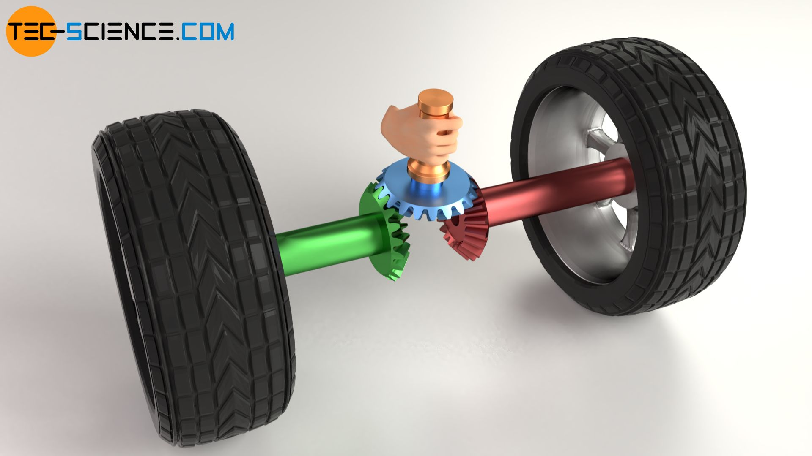
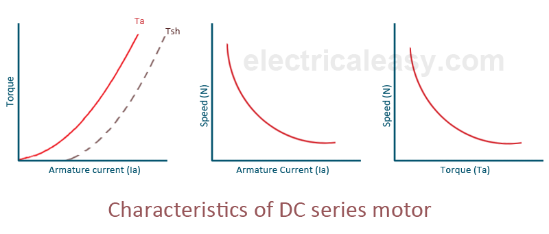

# Drive Motor Selection

This document covers the engineering process for selecting a drive motor
for the WRO 2026 Future Engineers vehicle. It explains the underlying
physics, the calculations used.

---

## Table of Contents

- [1. Setup and Drivetrain Configuration](#1-setup-and-drivetrain-configuration)
- [2. Understanding Torque](#2-understanding-torque)
- [3. Calculating Required Torque](#3-calculating-required-torque)
- [4. Calculating Required Speed](#4-calculating-required-speed)
- [5. The Speed-Torque Curve](#5-the-speed-torque-curve)
- [6. The Differential — Extra Consideration](#6-the-differential--extra-consideration)
---

## 1. Setup and Drivetrain Configuration

The vehicle uses a **single rear drive motor** connected to both rear wheels
through a differential. The differential allows the two wheels to rotate at
different speeds during turns, which is necessary for Ackermann steering
geometry to work correctly.

```
Battery → Motor → Differential → Rear Left Wheel
                              → Rear Right Wheel
```

<p align="center">
  

</p>


Because there is only one motor, its full torque output passes through a
single shaft into the differential. There is no per-wheel torque splitting
at the motor stage.

> **Rule compliance:** WRO 2026 Future Engineers rules prohibit one motor
> per wheel. A single motor driving both wheels through a mechanical
> linkage (differential) is fully compliant.

---

## 2. Understanding Torque

Torque is a rotational force — specifically, **force applied at a distance
from a pivot point.**

A practical way to think about it: pushing a door near the hinge requires
much more force than pushing at the far edge. The force is the same, but the
distance from the hinge (the moment arm) changes how effective it is.
That product of force × distance is torque.

For a drive wheel:

```
τ = F × r
```

| Variable | Meaning |
|---|---|
| `τ` | Torque (N·m or kg·cm) |
| `F` | Force applied at the wheel contact patch (N) |
| `r` | Wheel radius — the moment arm (m) |

Rearranged to find force at the ground:

```
F = τ / r
```

A motor with higher torque, or a smaller wheel radius, produces more pushing
force at the ground.

### Unit Conversion

Most hobby motor datasheets use `kg·cm`. To convert to SI:

```
1 kg·cm = 0.0981 N·m
```

---

## 3. Calculating Required Torque

The motor must provide enough torque to cover two conditions simultaneously:
accelerating the robot from rest, and overcoming rolling resistance during
motion.

### 3.1 Robot Parameters
All of which are arbitrary choosen, where I think that is the max we need for each.


| Parameter | Value |
|---|---|
| Robot mass `m` | 1.2 kg |
| Target acceleration `a` | 1.5 m/s² |
| Wheel radius `r` | 0.0325 m | 
|Rolling resistance coefficient `μ` | 0.05 |


### 3.2 Force Required at the Ground

**Acceleration force** — the force needed to change the robot's velocity:

```
F_accel = m × a
F_accel = 1.2 × 1.5 = 1.8 N
```

**Rolling resistance force** — friction between wheel and floor at constant motion:

```
F_roll = μ × m × g
F_roll = 0.05 × 1.2 × 9.81 = 0.59 N
```

**Total force required at the ground:**

```
F_total = F_accel + F_roll
F_total = 1.8 + 0.59 = 2.39 N
```

### 3.3 Required Torque at the Wheel

```
τ_wheel = F_total × r
τ_wheel = 2.39 × 0.0325 = 0.0777 N·m ≈ 0.79 kg·cm
```

### 3.4 Account for Drivetrain Losses

Torque is lost at every mechanical junction — the motor gearbox, differential
gears, and axle bearings. A realistic combined drivetrain efficiency is
**~70%**, meaning 30% of torque is consumed before reaching the ground.

```
τ_required = τ_wheel / η
τ_required = 0.79 / 0.70 ≈ 1.13 kg·cm
```

### 3.5 Apply the Safety Factor

The calculation above assumes ideal conditions — a perfectly flat clean floor,
no chassis flex, no variation in bearing friction, and no static friction
spike at startup. In practice, static friction at startup is always higher
than rolling friction, and conditions vary between rounds.

The standard rule for mobile robot motor sizing is to select a motor whose
**stall torque is at least 3× the calculated operating requirement.** This
simultaneously covers real-world losses and ensures the motor operates at
30–40% of its stall torque during normal driving. 

```
τ_stall_minimum = 1.13 × 3 = 3.4 kg·cm
```

**The motor stall torque must exceed ~3.5 kg·cm.**

---

## 4. Calculating Required Speed

### 4.1 Target Linear Speed

The WRO track is approximately **3 meters per lap**, making 3 laps roughly
9 meters of total driving distance.

The round time limit is 3 minutes, but time must be reserved for:
- Obstacle detection and avoidance reactions
- Deceleration before tight turns
- The parallel parking maneuver
- Stopping correctly in the finish section

Targeting driving completion in **~70 seconds** gives comfortable margin:

```
Minimum average speed = 9 m / 70 s ≈ 0.13 m/s
```

A practical cruise target is **0.5–1.0 m/s**, allowing the vehicle to slow
for obstacles and still finish well within the time limit.

### 4.2 Convert Speed to Required RPM

At a cruise target of **0.8 m/s**:

```
RPM = (v × 60) / (2π × r)
RPM = (0.8 × 60) / (2π × 0.0325)
RPM ≈ 235 RPM
```

The motor output shaft needs to spin at approximately **235 RPM** at cruise.
A motor rated above this provides headroom that is controlled via PWM
duty cycle.

---

## 5. The Speed-Torque Curve

A DC motor cannot simultaneously produce maximum torque and maximum speed.
The relationship between the two is **linear**, defined by two fixed endpoints:

<p align="center">
  
</p>


| Operating Point | Speed | Torque | Current Draw |
|---|---|---|---|
| No-load | Maximum | ~0 | Minimum |
| Target zone | Mid-range | 30–50% of stall | Moderate |
| Stall | 0 RPM | Maximum | Maximum |

### Why operating near stall is dangerous

- Current draw is at maximum → motor and driver overheat
- Gearbox is under peak stress → accelerated wear or mechanical failure
- Efficiency is near zero → all electrical input becomes heat, not motion

### The operating zone rule

The motor should be selected such that the expected operating torque falls
between 30–50% of its stall torque:

```
τ_stall ≥ τ_operating / 0.40
τ_stall ≥ 1.13 / 0.40 ≈ 2.83 kg·cm
```

This result converges with the 3× safety factor from Section 3.5. Both
methods confirm the stall torque must be above **~3.0–3.5 kg·cm.**

---

## 6. The Differential — Extra Consideration

An open differential splits torque **equally** between both output shafts
at all times. While mechanically simple and fully rules-compliant, it has
one known limitation:

> If one wheel loses traction, the differential sends all torque to the
> slipping wheel (the path of least resistance), and the gripping wheel
> loses its drive force.

On the WRO track — a smooth, flat, indoor surface — wheel slip is unlikely
under normal conditions. However, this behavior can appear during sharp
high-speed turns.

The practical mitigation is to **ramp motor speed gradually on startup**
rather than applying full PWM instantly. This reduces the peak torque spike
at the contact patch and minimizes the chance of slip at launch.
