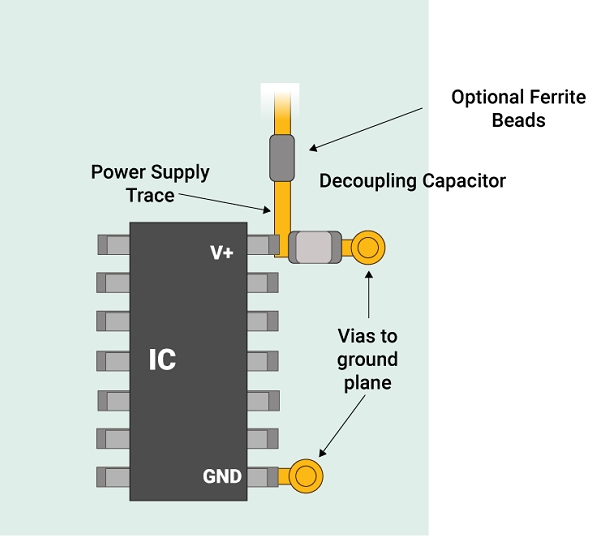
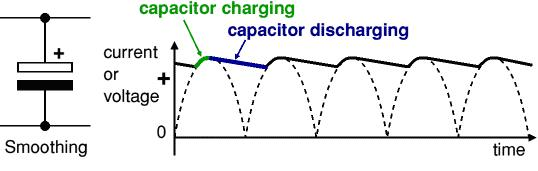
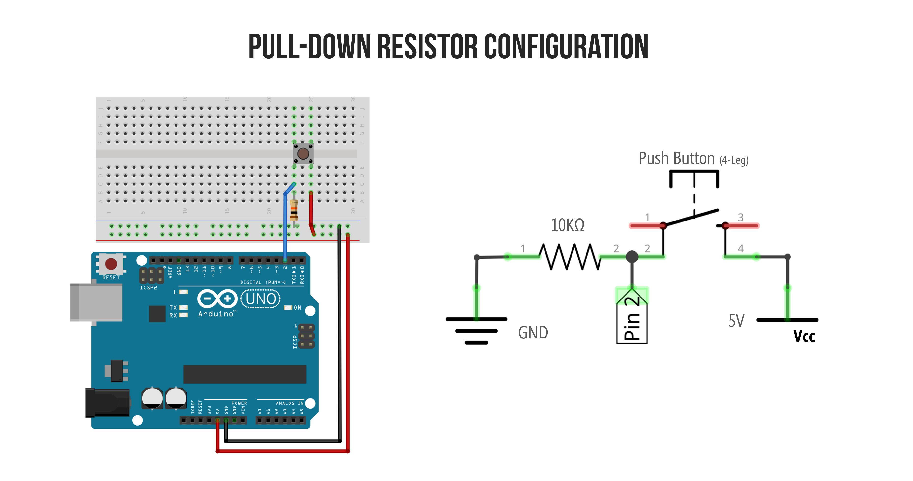
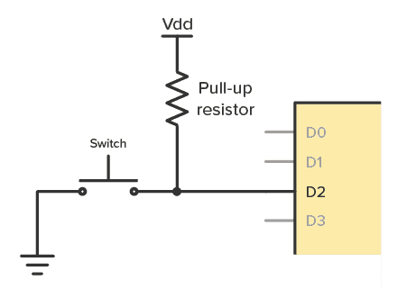

# Passive Components — Capacitors and Resistors

This document calculates the requirements for decoupling capacitors, bulk capacitors, and pull resistors used across the circuit. These are theoretical requirements based on standard design practice, not a list of parts used.

---

## Table of Contents

- [1. Decoupling Capacitors](#1-decoupling-capacitors)
- [2. Bulk Capacitors](#2-bulk-capacitors)
- [3. Pull-Down Resistors](#3-pull-down-resistors)
- [4. Pull-Up Resistors](#4-pull-up-resistors)
- [5. Summary](#5-summary)
- [Sources](#sources)

---

## 1. Decoupling Capacitors

<p align="center">
  
</p>

A decoupling capacitor sits right next to an IC's power pin. It supplies a quick burst of current when the chip switches state, so the chip doesn't pull that current from the long, slow power trace.

**Why it's needed:** Every digital switch (a GPIO toggling, a motor driver switching) causes a short current spike. Wires and traces have inductance, so they resist sudden current changes. Without a local capacitor, this causes voltage dips that can reset or glitch nearby ICs.

**Calculation — required capacitance:**

```
C = I × Δt / ΔV
```

| Variable | Meaning |
|---|---|
| `I` | Transient current spike |
| `Δt` | Duration of the switching event |
| `ΔV` | Maximum acceptable voltage dip |

Example, for a digital IC drawing a 50 mA transient spike over 10 ns, with a 0.1V allowed dip:

```
C = (0.05 × 10×10⁻⁹) / 0.1
C = 5 nF
```

**Standard practice value:** 100 nF (0.1 µF) ceramic capacitor per IC power pin. This value is oversized relative to the calculation above on purpose — it's cheap, small, and covers a wide range of switching speeds without needing per-chip calculation.

**Placement rule:** Within 2–5 mm of the IC's VCC pin, directly between VCC and GND.

---

## 2. Bulk Capacitors

<p align="center">
  
</p>

A bulk capacitor is larger and sits near the power input of a board or rail. It smooths out slower, larger current demands — like a motor starting or a servo moving under load — that a small decoupling cap cannot supply fast enough.

**Why it's needed:** Decoupling caps handle nanosecond-scale spikes. Motor stall current and servo current draw happen on a millisecond scale and pull much more current. Without a bulk cap, the whole rail voltage sags when the motor starts.

**Calculation — required capacitance:**

```
C = I × Δt / ΔV
```

Example, for a motor drawing a 2A stall current spike over 5 ms, with a 0.3V allowed sag:

```
C = (2 × 5×10⁻³) / 0.3
C = 33.3 mF ≈ 33,000 µF
```

This is unrealistically large for a single capacitor — in practice this load is handled by a combination of:
- The battery's own low internal resistance
- A moderate bulk cap (100–470 µF) at the regulator output
- The regulator's own transient response

**Standard practice value:** 100–470 µF electrolytic capacitor at each regulator output, in addition to the small decoupling caps at each IC.

---

## 3. Pull-Down Resistors

<p align="center">
  
</p>

A pull-down resistor connects a signal pin to ground through a resistor. When nothing is actively driving the pin, it settles at a known LOW state instead of floating.

**Why it's needed:** A floating digital input can read as random HIGH or LOW due to electrical noise. On a control pin like a motor driver's IN1/IN2/STBY, this is dangerous — the motor could spin unexpectedly on power-up before the microcontroller initializes.

**Calculation — required resistance:**

The resistor value is a trade-off:
- **Too low** → wastes current when the pin is actively driven HIGH
- **Too high** → too slow to pull down, more sensitive to noise

```
I_leak = V / R
```

For a 5V logic level and a target leakage current under 1 mA:

```
R ≥ V / I_leak
R ≥ 5 / 0.001
R ≥ 5 kΩ
```

**Standard practice value:** 10 kΩ. This is high enough to draw negligible current when the pin is driven, and low enough to firmly hold LOW when undriven.

**Where this applies:** Any control input pin that must default to a known safe state before the microcontroller boots and takes over — for example, motor driver direction and enable pins.

---

## 4. Pull-Up Resistors

<p align="center">
  
</p>

A pull-up resistor is the mirror of a pull-down: it connects a signal pin to the supply voltage through a resistor, so the pin defaults HIGH instead of LOW when nothing drives it.

**Why it exists:** Some devices communicate using open-drain outputs (I2C is the most common example) — they can only pull a line LOW, never drive it HIGH. A pull-up resistor is required to bring the line back to HIGH when released.

**Calculation — same formula as pull-down:**

```
R ≥ V / I_leak
```

For 5V logic and 1 mA leakage limit:

```
R ≥ 5 kΩ
```

**Standard practice value:** 4.7 kΩ–10 kΩ, same reasoning as the pull-down case.

**Why not used in this design:** All control signals in this circuit (motor driver inputs, servo PWM) are actively push-pull driven by the microcontroller at all times after boot — they are never left floating or open-drain. I2C buses (ToF sensors, IMU) already have internal or module-level pull-ups on their SDA/SCL lines, so no additional pull-ups were required on the main board.

---

## 5. Summary

| Component | Value | Purpose |
|---|---|---|
| Decoupling capacitor | 100 nF ceramic | Per-IC high-frequency noise suppression |
| Bulk capacitor | 100–470 µF electrolytic | Rail-level current surge smoothing |
| Pull-down resistor | 10 kΩ | Safe default LOW on control pins before MCU boot |
| Pull-up resistor | 4.7–10 kΩ (not used) | Would be needed only for open-drain signals |

---

## Sources

| Source | Description |
|---|---|
| [Sierra Circuits — Decoupling Capacitor Placement Guidelines](https://www.protoexpress.com/) | Placement and value selection practice |
| Horowitz & Hill — The Art of Electronics | Decoupling and bulk capacitor theory |
| [Aticleworld — Pull-Up Resistor: How It Works](https://aticleworld.com/) | Pull-up resistor calculation and use cases |
| TI Application Report — Understanding and Using Decoupling Capacitors | Transient current and voltage dip calculation basis |
