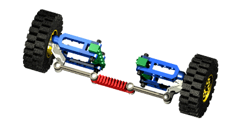
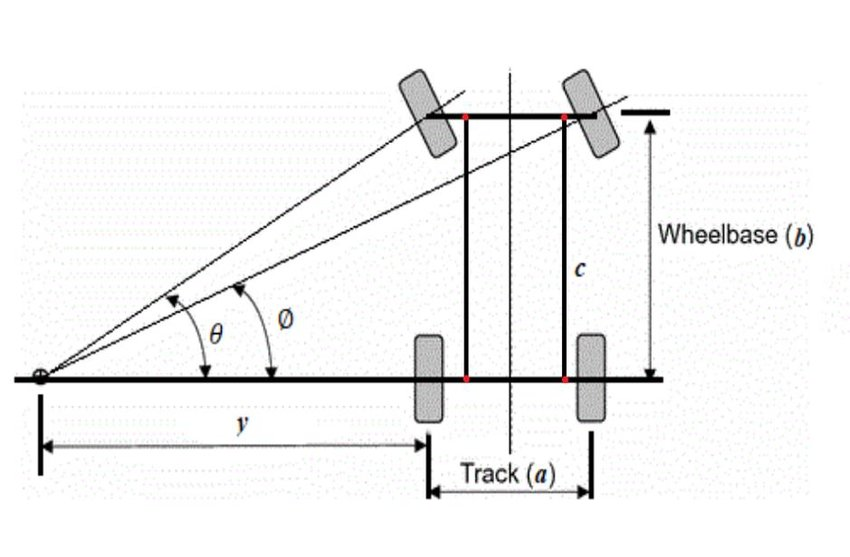
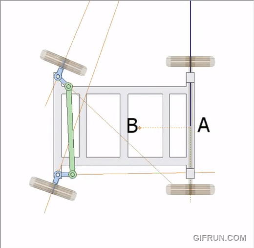
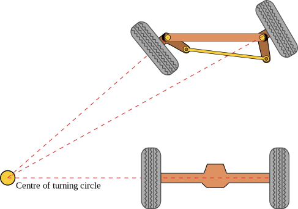
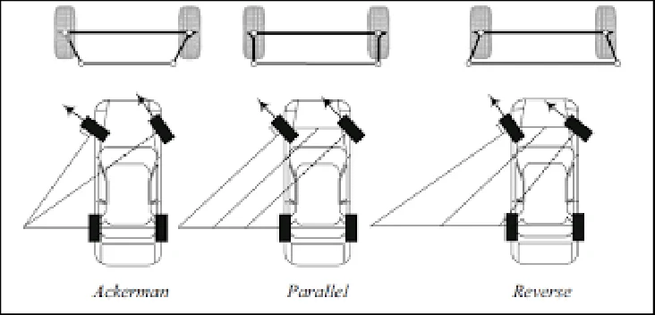

# Ackermann Steering Geometry

This document covers the engineering basis for the steering system used in the WRO 2026 Future Engineers vehicle. It explains what Ackermann geometry is from first principles, how it compares to alternative steering configurations, the math behind it, and why it was selected for this robot.

---

## Table of Contents

- [1. The Steering Problem](#1-the-steering-problem)
- [2. What Is Ackermann Geometry](#2-what-is-ackermann-geometry)
- [3. How It Works Mechanically](#3-how-it-works-mechanically)
- [4. The Ackermann Condition — Math](#4-the-ackermann-condition--math)
- [5. Steering Geometry Types](#5-steering-geometry-types)
  - [5.1 Parallel Steering (0% Ackermann)](#51-parallel-steering-0-ackermann)
  - [5.2 Pure Ackermann (100%)](#52-pure-ackermann-100)
  - [5.3 Anti-Ackermann (Reverse)](#53-anti-ackermann-reverse)
- [6. What We Use](#6-what-we-use)
- [7. Effect on Robot Navigation](#7-effect-on-robot-navigation)
- [8. Turning Radius Calculation](#8-turning-radius-calculation)
- [Sources](#sources)

---

## 1. The Steering Problem

When a vehicle turns, each wheel traces a different arc. The inner wheel follows a tight radius while the outer wheel follows a wider one. Both wheels must cover their respective arcs **in the same time** — which means they must travel at different speeds, or equivalently, point at different angles.

<figure style="text-align: center;">
  
  <figcaption>Fig 1.1 — In a turn, the inner wheel traces a shorter arc than the outer wheel</figcaption>
</figure>

If both front wheels are forced to point at the same angle (parallel steering), one of them must **scrub** — drag sideways across the floor. On a competition mat, this introduces:

- Lateral displacement that is unpredictable in software
- Reduced odometry accuracy
- Increased positioning error for parking maneuvers

> **The core problem Ackermann solves:** How do you mechanically ensure the inner wheel always turns more sharply than the outer wheel, for every steering angle, without software control?

---

## 2. What Is Ackermann Geometry

<figure style="text-align: center;">
  
  <figcaption>Fig 2.1 — Ackermann geometry in action: inner wheel turns more than outer wheel</figcaption>
</figure>

<br>

Ackermann steering geometry is a **purely mechanical** solution. It was invented by German carriage builder Georg Lankensperger in Munich in 1816, and patented in England by his agent Rudolph Ackermann in 1818 — originally for horse-drawn carriages.

The principle: arrange the steering linkage so that lines drawn through each front wheel's steering axis converge at a single point on the rear axle. This causes the inner wheel to automatically rotate through a larger angle than the outer wheel during any turn, keeping both wheels pointed toward a common turn center with no scrub.

<figure style="text-align: center;">
  
  <figcaption>Fig 2.2 — Lines through each kingpin and steering arm must meet at the center of the rear axle for perfect Ackermann</figcaption>
</figure>

> **Key property:** Ackermann geometry is purely kinematic — it is not affected by external forces. The correct wheel angles are achieved through linkage geometry alone, requiring no sensors, no software, and no active control.

---

## 3. How It Works Mechanically

The steering linkage consists of four key elements:

| Component | Function |
|---|---|
| **Kingpins** | Vertical pivot points at each front wheel hub |
| **Steering arms** | Levers attached to each kingpin, angled inward |
| **Tie rod** | Rigid bar connecting both steering arms |
| **Servo / rack** | Input that pushes or pulls the tie rod sideways |

<figure style="text-align: center;">
  
  <figcaption>Fig 3.1 — The steering arms and tie rod form a trapezoid shape when wheels are straight ahead</figcaption>
</figure>

**The inward angle of the steering arms is the key.** When the tie rod is pushed left:

1. The left steering arm rotates, pulling the left wheel to a sharp angle (inner wheel)
2. The right steering arm rotates, pushing the right wheel to a shallower angle (outer wheel)
3. Because the arms are angled inward, this differential is built into the geometry

**Straight ahead:** Both wheels point forward in parallel. No differential needed.

**In a turn:** The trapezoidal geometry automatically generates the correct difference in angle between the inner and outer wheels, for any steering input magnitude.

<figure style="text-align: center;">
  
  <figcaption>Fig 3.2 — As the servo turns the steering, the inner wheel always rotates through a larger angle than the outer</figcaption>
</figure>

---

## 4. The Ackermann Condition — Math

For perfect Ackermann geometry, the following trigonometric relationship must hold at every steering angle:

```
cot(δ_outer) - cot(δ_inner) = T / L
```

| Variable | Meaning |
|---|---|
| `δ_outer` | Angle of the outer (less-turned) front wheel |
| `δ_inner` | Angle of the inner (more-turned) front wheel |
| `T` | Track width — distance between the two front wheel centerlines |
| `L` | Wheelbase — distance between front and rear axles |

This is called the **Ackermann condition**. When it is satisfied, all four wheels trace concentric circles around a single turn center, with zero lateral scrub.

### Applying to this robot

Our chassis parameters:

| Parameter | Value |
|---|---|
| Wheelbase `L` | ~180 mm |
| Track width `T` | ~120 mm |

At a moderate inner steering angle of `δ_inner = 30°`:

```
cot(δ_outer) = cot(30°) - T/L
cot(δ_outer) = 1.732 - (120/180)
cot(δ_outer) = 1.732 - 0.667 = 1.065
δ_outer = arccot(1.065) ≈ 43.2° → δ_outer ≈ 23.2°
```

So the outer wheel should turn approximately **23°** while the inner wheel turns **30°**. The Ackermann trapezoid linkage achieves this automatically through geometry.

### Turning Radius

The overall turning radius (measured from the rear axle center) is:

```
R = L / tan(δ_avg)
```

Where `δ_avg` is approximately the average of the two front wheel angles. At `δ_avg ≈ 26.5°`:

```
R = 180 / tan(26.5°) ≈ 180 / 0.499 ≈ 360 mm
```

The robot can complete a **~360 mm radius turn** at moderate steering lock. The WRO track corners have an inner wall radius large enough to accommodate this.

---

## 5. Steering Geometry Types

Three fundamentally different geometries exist. The choice affects positional accuracy, tire wear, and — critically for competition — the consistency of turns.

### 5.1 Parallel Steering (0% Ackermann)

Both front wheels turn through the same angle regardless of which is inner or outer.

<figure style="text-align: center;">
  
  <figcaption>Fig 5.1 — Parallel steering: both wheels at same angle, causing inner wheel scrub</figcaption>
</figure>

| Property | Value |
|---|---|
| Scrub | High — inner wheel drags sideways |
| Mechanical simplicity | High — simpler linkage |
| Positional accuracy | Low — lateral displacement from scrub |
| Turn consistency | Poor — scrub force varies with speed and floor friction |

**Why rejected:** Scrub-induced lateral displacement is not constant. It varies with floor friction, speed, and tire compound — making it impossible to compensate reliably in software. In the obstacle challenge, this directly compromises parking precision.

### 5.2 Pure Ackermann (100%)

Inner wheel turns more than outer wheel, satisfying the Ackermann condition exactly.

<figure style="text-align: center;">
  
  <figcaption>Fig 5.2 — Pure Ackermann: all four wheels point to a common turn center</figcaption>
</figure>

| Property | Value |
|---|---|
| Scrub | Minimal to zero at low speed |
| Mechanical simplicity | Moderate — trapezoidal linkage |
| Positional accuracy | High |
| Turn consistency | High — predictable arc |

**Why selected:** Ideal for low-speed, precision maneuvering. The WRO competition operates entirely in the low-speed regime where Ackermann geometry is most effective.

### 5.3 Anti-Ackermann (Reverse)

Outer wheel turns more than inner wheel — the reverse of Ackermann.

| Property | Value |
|---|---|
| Scrub | Very high at low speed |
| Use case | High-speed racing only — improves slip angle balance at speed |
| Positional accuracy | Low |

**Why rejected:** Anti-Ackermann is designed for high-speed motorsport where tyre slip angles dominate. At robot competition speeds (< 1 m/s), it produces worse scrub than even parallel steering.

### Comparison Table

| Geometry | Scrub at Low Speed | Turn Consistency | Parking Precision | Use Case |
|---|---|---|---|---|
| Parallel (0%) | High | Poor | Low | Simple mechanisms, off-road |
| Ackermann (100%) | Zero | High | High | Road vehicles, robots, forklifts |
| Anti-Ackermann | Very High | Very Poor | Very Low | High-speed racing only |

---

## 6. What We Use

The robot uses a **pure Ackermann front steering geometry** actuated by an MG996R servo motor.

**Reasons for selection:**

- **Zero scrub:** Eliminates unpredictable lateral displacement during turns. Directly improves heading accuracy and parking repeatability.
- **Software simplicity:** Because the geometry is correct mechanically, the IMU-based heading controller does not need to compensate for scrub. The robot turns where it is pointed.
- **Competition relevance:** The WRO track consists of 90° corners at low speed. This is exactly the operating regime where Ackermann geometry outperforms alternatives.
- **Rule compliance:** WRO 2026 requires a single steering actuator. A servo driving a standard Ackermann trapezoid linkage is the most direct implementation.
- **Precedent:** Consistently used by top-placing WRO Future Engineers teams including LazyGo (Bangladesh, 2025) and Nerdvana (Romania, 2024).

**Implementation:**

The MG996R servo output horn connects to the tie rod. The steering arms on each front kingpin are angled inward to form the Ackermann trapezoid. The servo pulse width is mapped to steering angle via the `set_angle()` API in `servo_control.c`.

---

## 7. Effect on Robot Navigation

Ackermann geometry has direct consequences for the software architecture:

**Heading hold (straight lines):** With zero scrub, the robot's actual heading closely tracks the IMU heading. The forward PID controller corrects only genuine drift (e.g., from floor unevenness), not scrub-induced displacement.

**90° turns:** The turn controller commands a fixed heading change via the IMU. Because the wheels track geometrically correct arcs, the robot reaches the target heading predictably without needing to compensate for lateral error introduced by scrub.

**Odometry:** The encoder on the rear axle reads the true distance traveled. Without scrub, encoder-derived distance maps directly to forward displacement. This is used for lap counting and finish-section positioning.

> **Contrast with a solid axle:** On a solid axle robot, every 90° turn introduces scrub-derived lateral displacement of several centimeters. This displacement is not captured by the encoder and not corrected by the IMU heading controller, causing cumulative positional error across 3 laps × 4 corners = 12 turns.

---

## 8. Turning Radius Calculation

The minimum turning radius constrains whether the robot can fit through the WRO track corners without hitting the inner wall.

**Track corner geometry (from WRO 2026 rules):**
- Inner wall forms the inner boundary of the corner section
- The robot must stay within the corridor (600–1000 mm wide depending on the round)

**Robot turning radius at full servo lock:**

```
R_min = L / tan(δ_max)
```

With our chassis (`L ≈ 180 mm`) and servo maximum angle (`δ_max ≈ 30°`):

```
R_min = 180 / tan(30°) = 180 / 0.577 ≈ 312 mm
```

The minimum turning radius is approximately **312 mm**, measured from the rear axle to the turn center. This is comfortably within the WRO corner geometry, which allows for a much larger radius. The robot is not turning radius-limited on this track.

---

## Sources

| Source | Description |
|---|---|
| [Wikipedia — Ackermann Steering Geometry](https://en.wikipedia.org/wiki/Ackermann_steering_geometry) | Geometry definition, history, Lankensperger patent |
| [Tire Technology International — The Story of Ackermann Steering](https://www.tiretechnologyinternational.com/opinion/the-story-of-ackermann-steering.html) | History, dynamic vs. kinematic Ackermann, industry usage |
| [FIRGELLI Automations — Ackermann Steering Linkage Mechanism](https://www.firgelliauto.com/blogs/mechanisms/ackermann-steering-linkage) | Interactive diagram, trapezoidal linkage explanation |
| [Suspension Secrets — Ackermann](https://suspensionsecrets.co.uk/ackermann/) | Slip angle theory, motorsport applications |
| [Flow Racers — Ackermann Steering Geometry](https://flowracers.com/blog/ackermann-steering-geometry/) | Practical explanation of Ackermann percentage |
| [ResearchGate — Design and Development of Four-Wheel Steering for ATV](https://www.researchgate.net/figure/Ackermann-steering-mechanism-This-is-the-diagram-for-the-Ackermann-steering-mechanism_fig1_346561431) | Scientific diagram of Ackermann mechanism with labeled parameters |
| [LazyGo WRO 2025 — Bangladesh](https://github.com/A-N-M-Noor/LazyGo_WRO2025) | Reference team Ackermann implementation |
| [Nerdvana WRO 2024 — Romania](https://github.com/mihaipriboi/WRO_Future_Engineers_2024) | Reference team Ackermann implementation |
| Milliken & Milliken — Race Car Vehicle Dynamics (SAE, 1995) | Ackermann condition derivation, steering geometry theory |
| [WRO 2026 Future Engineers Rules](https://wro-association.org) | Track dimensions, single steering actuator requirement |
