

  

<h1 align="center">Team Lannister — WRO 2026 Future Engineers</h1>

  <em>A self-driving car, built from scratch.</em>

  <em>Hear me Roar.</em>

---

## Table of Contents

- [1. The Team](#1-the-team)
- [2. The Challenge](#2-the-challenge)
- [3. Mechanical Design](#3-mechanical-design)
  - [3.1 Chassis — Three Levels](#31-chassis--three-levels)
  - [3.2 Chassis & Deck Drawings](#32-chassis--deck-drawings)
  - [3.3 Steering — Ackermann Geometry](#33-steering--ackermann-geometry)
  - [3.4 Drivetrain](#34-drivetrain)
  - [3.5 Design Iterations](#35-design-iterations)
- [4. Hardware Overview](#4-hardware-overview)
  - [4.1 The Two Brains: ESP32 + Raspberry Pi 5](#41-the-two-brains-esp32--raspberry-pi-5)
  - [4.2 Vision: Raspberry Pi Camera Module 3](#42-vision-raspberry-pi-camera-module-3)
  - [4.3 Bill of Materials](#43-bill-of-materials)
  - [4.4 Power Architecture](#44-power-architecture)
  - [4.5 Wiring](#45-wiring)
- [5. Software](#5-software)
- [6. The Vehicle](#6-the-vehicle)
- [7. Videos](#7-videos)
- [8. Repository Map](#8-repository-map)
- [9. Build & Run](#9-build--run)
- [10. Behind the Build](#10-behind-the-build)

---

## 1. The Team

<table align="center">
<tr>
<td align="center" width="380">
 
<b>The official photo</b>
</td>
<td align="center" width="380">
 
<b>The one that actually looks like us</b>
</td>
</tr>
</table>

---

<table align="center">
<tr>
<td align="center" width="240">
 
<b>Abdalraheem Shuaibi</b> 
Hardware & PCB Design / Software
</td>
<td align="center" width="240">
 
<b>Abdulrahman Sawalmeh</b> 
Mechanical Design / 3D Modelling
</td>
</tr>
</table>

I'm a 21-year-old Computer Engineering student at Birzeit University. I started learning embedded systems and firmware development about two years ago — largely self-taught, out of necessity. Structured resources for this kind of work are scarce where I'm from, so my path went from basic circuits and electronics theory all the way to PCB design, and from simple Arduino sketches to FreeRTOS and ESP-IDF, the same stack powering this robot.

Alongside this competition, I've been juggling a graduation project funded by the EU and the Palestinian Ministry of Health — a commitment that's demanded careful time management this season.

This isn't my first attempt at WRO Future Engineers. I competed alone in the 2025 season and things were going well, until a sensor burned out just before the local competition, ending that run early. That experience is a big part of why this repository exists in the form it does now — more testing, more documentation, fewer single points of failure.

---

## 2. The Challenge

  

WRO Future Engineers asks for a vehicle that can drive itself — no remote control, no shortcuts, just sensors, math, and code making decisions in real time. The car has to complete laps around a track that changes every round: walls move, corners narrow, and in the Obstacle Challenge, coloured pillars appear that the car has to read and respond to correctly. Get it wrong, and the round ends early.

It's a small, contained problem on paper. In practice, it touches almost every corner of engineering: mechanical design, power distribution, real-time firmware, computer vision, and the occasional very frustrating GPIO conflict at 2 AM.

---

## 3. Mechanical Design

Every structural part of this vehicle is custom-designed and 3D-printed. Nothing here is off the shelf except the WLTOYS 144001 differential and the wheels — everything else, from the chassis plate to the servo arm, was modelled in Fusion 360 and iterated through at least one physical revision. Full technical documentation, iteration stories, and manufacturing notes live in [`03_Models/00_models.md`](03_Models/00_models.md).

---

### 3.1 Chassis — Three Levels

The 300 × 200 mm footprint limit means the layout grows upward, not outward. One plate — `main_base` (254 × 100 mm) — carries everything, with standoff columns supporting two raised decks above it.

<table align="center">
<tr>
<td align="center" width="500">
 
<b>Pi 5 and ESP32 stacked on the upper decks, fully wired</b>
</td>
</tr>
</table>

| Level | Part | What lives there |
|-------|------|-----------------|
| Ground plate | `main_base` | Motor (mount built into the plate), differential assembly, steering knuckles, column standoffs |
| Front deck | `front_top` | MG996R steering servo, camera mast |
| Middle deck | `middle_top` | Main soldered PCB — see [`04_PCB`](04_PCB/00_PCB.md) |
| Rear deck | `back_top` | Raspberry Pi 5 + power bank |
| Mast | `camera_holder` | Camera Module 3, raised 154.7 mm above the chassis and angled at the track |

Two decisions behind this layout that are worth naming:

**The motor mount is part of the chassis plate, not a bracket.** The JGB37-520 sits in a pocket extruded directly into `main_base`. One fewer part to print, no joint to come loose from vibration, and the motor-to-differential alignment is determined by the geometry of a single piece rather than assembly accuracy.

**Electronics decks are removable.** Each deck comes off with a few screws, so electrical work never requires touching the drivetrain and mechanical work never requires unscrewing electronics. During a competition day, that separation is the difference between a five-minute fix and a full teardown.

---

### 3.2 Chassis & Deck Drawings

Click any drawing to open the full dimensioned PDF.

**Chassis, Decks & Camera**

<table align="center">
<tr>
<td align="center" width="370">
<a href="03_Models/drawings/main_base.pdf">
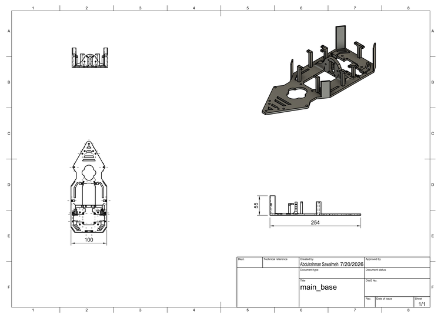
</a> 
<b><a href="03_Models/drawings/main_base.pdf">main_base.pdf</a> — Chassis plate (254 × 100 × 55 mm)</b>
</td>
<td align="center" width="370">
<a href="03_Models/drawings/front_top.pdf">
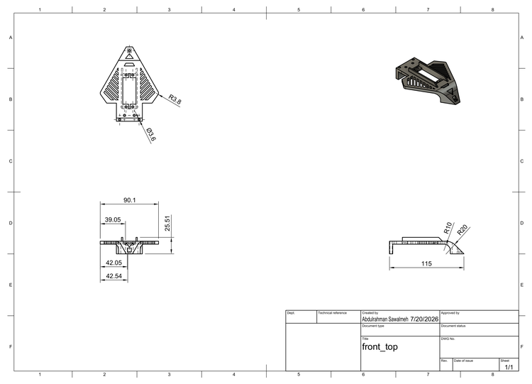
</a> 
<b><a href="03_Models/drawings/front_top.pdf">front_top.pdf</a> — Servo & camera deck (90 × 115 × 25 mm)</b>
</td>
</tr>
<tr>
<td align="center" width="370">
<a href="03_Models/drawings/mid_top.pdf">
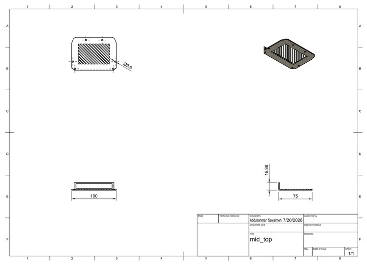
</a> 
<b><a href="03_Models/drawings/mid_top.pdf">mid_top.pdf</a> — PCB platform (100 × 75 × 17 mm)</b>
</td>
<td align="center" width="370">
<a href="03_Models/drawings/back_top.pdf">
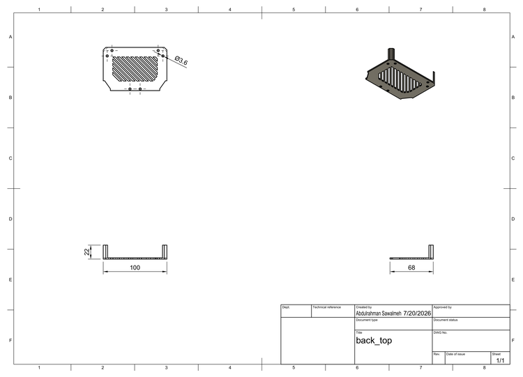
</a> 
<b><a href="03_Models/drawings/back_top.pdf">back_top.pdf</a> — Pi & power bank deck (100 × 68 × 22 mm)</b>
</td>
</tr>
</table>

<table align="center">
<tr>
<td align="center" width="500">
<a href="03_Models/drawings/camera_holder.pdf">
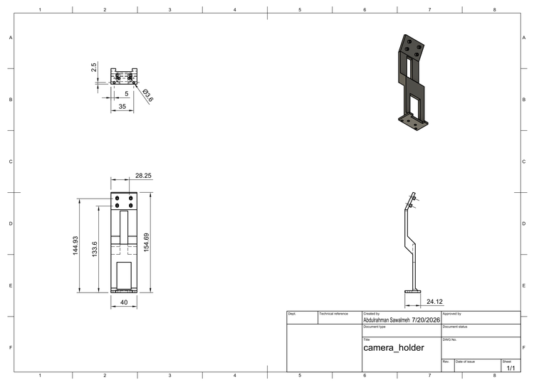
</a> 
<b><a href="03_Models/drawings/camera_holder.pdf">camera_holder.pdf</a> — Camera mast (40 × 24 × 154.7 mm) — the tallest printed part, raising the lens above the vehicle body</b>
</td>
</tr>
</table>

---

### 3.3 Steering — Ackermann Geometry

The front wheels don't turn at the same angle — they can't. In any turn, the inner wheel follows a tighter arc than the outer one, so turning both wheels by the same amount always forces one of them to scrub sideways. Ackermann geometry fixes this by angling the steering linkage so the inner wheel always steers sharper than the outer one, pointing every wheel at a common turn center.

<table align="center">
<tr>
<td align="center" width="400">
 
<b>Ackermann geometry in action</b>
</td>
<td align="center" width="400">
 
<b>The trapezoid linkage</b>
</td>
</tr>
</table>

The geometry is implemented in three printed parts: the `left_knuckle` and `right_knuckle` pivot on kingpins at the chassis, and the `ackerman_rod` connects both knuckle eyes with a servo arm driving its center. The tie-rod eyes are angled inward so the line through each kingpin and its eye converges at the rear axle — the Ackermann condition. Verified directly in CAD:

<table align="center">
<tr>
<td align="center" width="350">
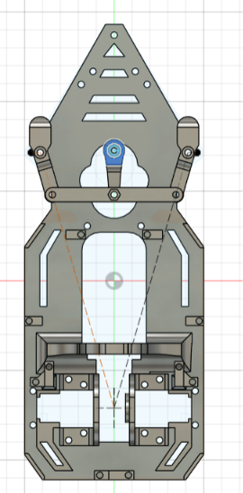 
<b>Top view in Fusion 360 — construction lines from the steering pivots converge at the rear axle centerline</b>
</td>
</tr>
</table>

Full geometry, math, and the comparison against parallel steering is in [`00_Research/04_mechanical/02_ackermann-steering.md`](00_Research/04_mechanical/02_ackermann-steering.md). The torque requirement that selected the MG996R servo is in [`00_Research/03_components_selection/02_servo-torque-requirement.md`](00_Research/03_components_selection/02_servo-torque-requirement.md).

**Steering parts drawings**

<table align="center">
<tr>
<td align="center" width="250">
<a href="03_Models/drawings/ackerman_rod.pdf">
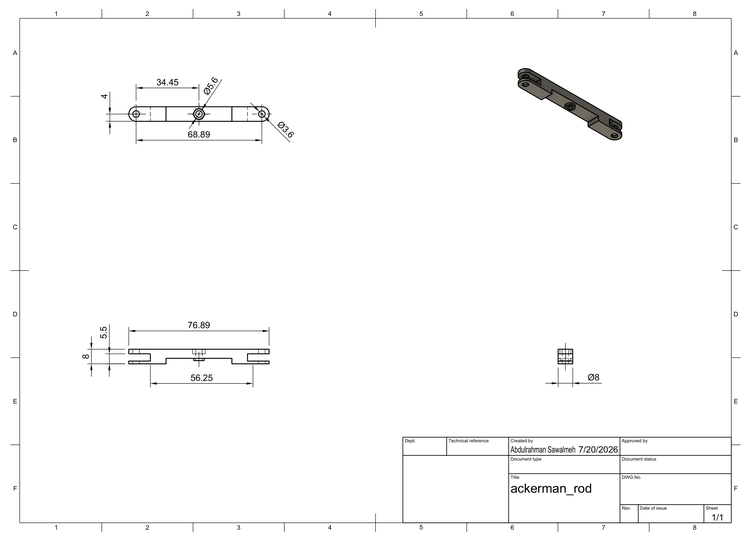
</a> 
<b><a href="03_Models/drawings/ackerman_rod.pdf">ackerman_rod.pdf</a> Tie rod (76.9 × 8 × 8 mm)</b>
</td>
<td align="center" width="250">
<a href="03_Models/drawings/knuckles.pdf">
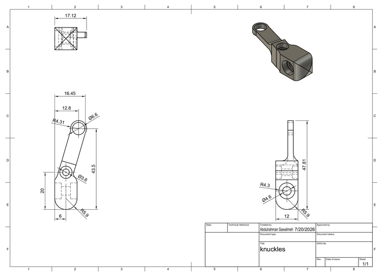
</a> 
<b><a href="03_Models/drawings/knuckles.pdf">knuckles.pdf</a> L/R knuckles (17 × 47.8 × 12 mm)</b>
</td>
<td align="center" width="250">
<a href="03_Models/drawings/servo_arm.pdf">
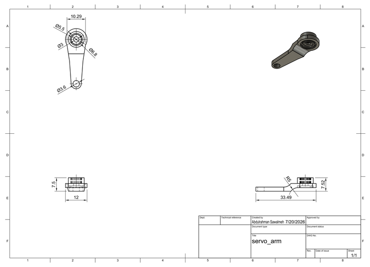
</a> 
<b><a href="03_Models/drawings/servo_arm.pdf">servo_arm.pdf</a> Servo arm (33.5 × 12 × 7.5 mm)</b>
</td>
</tr>
</table>

---

### 3.4 Drivetrain

A single JGB37-520 motor drives both rear wheels through a WLTOYS 144001 open differential — an off-the-shelf RC part that needed a fully custom mounting system because it was never designed for this chassis. The mounting system is five printed parts around a single off-the-shelf differential.

<table align="center">
<tr>
<td align="center" width="400">
 
<b>The differential in motion</b>
</td>
<td align="center" width="400">
 
<b>Inner vs. outer wheel arc — why it matters</b>
</td>
</tr>
</table>

Torque path: motor → bevel pinion (`motor_gear`) → differential crown → drive cups (`differantial_cup`) → 4 mm shafts → rear wheels. The differential splits torque purely mechanically — one motor, gears doing the work — which keeps us compliant with rule 11.5 (electronic differentials, one motor per side, are banned) while still letting the two rear wheels rotate at different speeds in corners.

Full drivetrain reasoning is in [`00_Research/04_mechanical/01_Differential.md`](00_Research/04_mechanical/01_Differential.md).

**Drivetrain parts drawings**

<table align="center">
<tr>
<td align="center" width="370">
<a href="03_Models/drawings/motor_gear.pdf">
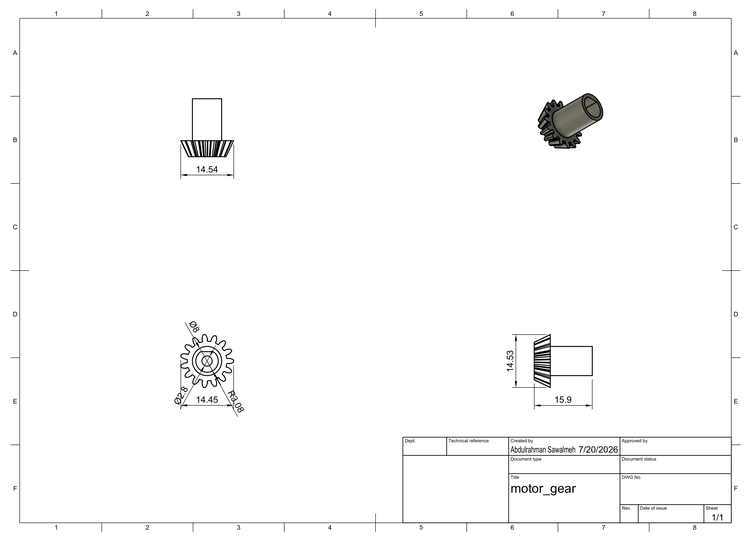
</a> 
<b><a href="03_Models/drawings/motor_gear.pdf">motor_gear.pdf</a> — Bevel pinion (14.5 × 15.9 × 14.5 mm)</b>
</td>
<td align="center" width="370">
<a href="03_Models/drawings/differantial_rings_holder.pdf">
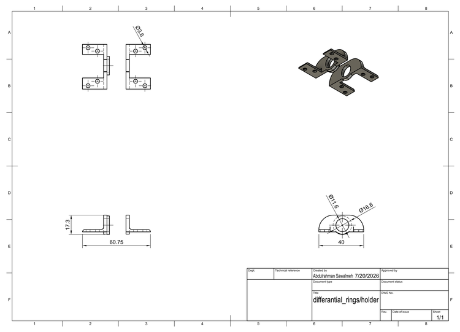
</a> 
<b><a href="03_Models/drawings/differantial_rings&holder.pdf">differantial_rings&holder.pdf</a> — Carrier rings + retaining ring</b>
</td>
</tr>
<tr>
<td align="center" width="370">
<a href="03_Models/drawings/differantial_cup.pdf">
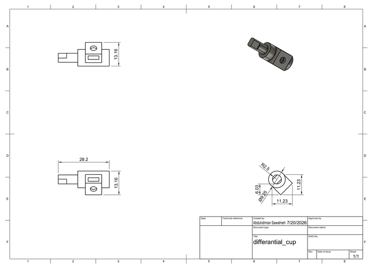
</a> 
<b><a href="03_Models/drawings/differantial_cup.pdf">differantial_cup.pdf</a> — Drive coupling cup (28.2 × 13.2 × 13.2 mm)</b>
</td>
<td align="center" width="370">
<a href="03_Models/drawings/shaft_holder.pdf">
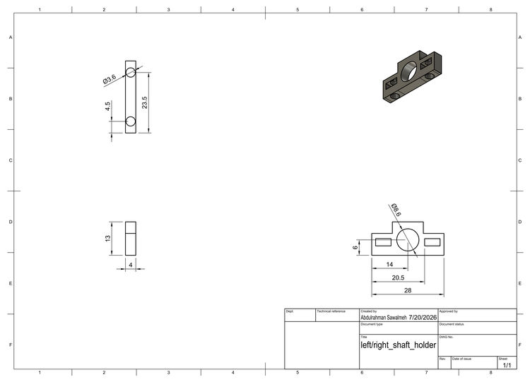
</a> 
<b><a href="03_Models/drawings/shaft_holder.pdf">shaft_holder.pdf</a> — Outboard bearing block (28 × 13 mm, 4 mm shaft)</b>
</td>
</tr>
</table>

---

### 3.5 Design Iterations

The drivetrain didn't work on the first try. Two physical problems had to be solved before the car drove properly — both visible in the current set of parts.

**Iteration 1 — Differential axial play.** The differential could slide sideways between its two carrier rings, shifting the bevel gear mesh and causing skips under load. The obvious fixes — thicken one carrier ring inward — were blocked by the motor's pinion on one side and a gear on the other. The solution was a separate 2.25 mm retaining ring (`differantial_holder`) glued to the right carrier, surrounding the differential bearing and closing the gap without entering either gear's space. A packaging constraint blocking both obvious solutions, forcing a third one.

**Iteration 2 — Rear wheel tilt.** Each drive shaft was originally supported only at its inboard end, at the differential carrier ring. The wheel hung on the free end of a cantilever and visibly tilted. Adding outboard bearing blocks (`left_shaft_holder`, `right_shaft_holder`) converted every shaft from a cantilevered load to a two-point supported one. The tilt disappeared.

Full iteration writeup with technical detail: [`03_Models/00_models.md#design-iterations`](03_Models/00_models.md#5-design-iterations)

---

## 4. Hardware Overview

### 4.1 The Two Brains: ESP32 + Raspberry Pi 5

The robot runs on two separate computers, each doing a different job.

<table align="center">
<tr>
<td align="center" width="260">
 
<b>ESP32 — real-time control</b>
</td>
<td align="center" width="260">
 
<b>Raspberry Pi 5 — vision</b>
</td>
</tr>
</table>

The **ESP32** handles everything that has to happen in real time and can't afford to be late: reading the ToF sensors, reading the IMU, driving the motor, driving the steering servo, and running the state machine that decides what the car does next. It runs FreeRTOS, with each task — sensing, control, algorithm — kept strictly separated so a slow camera frame on the other board can never introduce jitter into a steering correction.

The **Raspberry Pi 5** is reserved for vision. Camera processing is comparatively heavy and doesn't need to run at the same tight, predictable cadence as motor control — so it lives on its own board entirely, talking to the ESP32 over UART.

  

<b>How the two boards talk to each other</b>

Splitting the compute this way means a heavy vision frame never stalls a steering correction, and a firmware crash on the ESP32 doesn't take the camera pipeline down with it.

---

### 4.2 Vision: Raspberry Pi Camera Module 3

<table align="center">
<tr>
<td align="center" width="220">
 
<b>Camera Module 3, wide-angle</b>
</td>
</tr>
</table>

We're using the **Raspberry Pi Camera Module 3**, wide-angle variant (~120° diagonal FoV), connected over the Pi 5's CSI port. The wide field of view matters here — the car needs to see pillars and track edges well before it's close enough for a narrow lens to catch them, giving the vision pipeline more time to make a decision.

<table align="center">
<tr>
<td align="center" width="400">
 
<b>Connecting the camera</b>
</td>
</tr>
</table>

---

### 4.3 Bill of Materials

Every component on this robot was chosen against a calculated requirement first, not picked off a shelf. The motor's stall torque, the servo's stall torque, even the capacitor and resistor values, all trace back to a number derived in [`00_Research`](00_Research) before a single part was ordered.

---

**Compute — the two things that think**

<table align="center">
<tr>
<td align="center" width="240">
 
<b>Raspberry Pi 5</b>
</td>
<td align="center" width="240">
 
<b>ESP32-DEVKITC-32D</b>
</td>
</tr>
</table>

The **Raspberry Pi 5** handles vision — capturing and processing camera frames, deciding where pillars are. The **ESP32-DEVKITC-32D** handles everything that needs to happen on a strict, predictable schedule: reading sensors, driving the motor, driving the servo, and running the state machine.

---

**Sensors — the three things that feel the track**

<table align="center">
<tr>
<td align="center" width="240">
 
<b>BNO055 IMU</b>
</td>
<td align="center" width="240">
 
<b>VL53L0X ToF ×3</b>
</td>
</tr>
</table>

The **BNO055 IMU** gives the robot an absolute sense of heading — it's what lets the car hold a straight line and execute a clean 90° turn without drifting. Three **VL53L0X ToF sensors** (front, left, right) act as the robot's proximity sense. A **hall-effect encoder** on the drive shaft provides distance and speed feedback for odometry.

---

**Actuators — the two things that move the car**

<table align="center">
<tr>
<td align="center" width="240">
 
<b>JGB37-520 DC motor</b>
</td>
<td align="center" width="240">
 
<b>MG996R servo</b>
</td>
</tr>
</table>

The **JGB37-520 DC gear motor** drives the rear axle through the differential — sized so its stall torque clears ≥ 0.6 kg·cm, with full derivation in [`01_motor-selection-criteria.md`](00_Research/03_components_selection/01_motor-selection-criteria.md). The **MG996R servo** handles Ackermann steering up front, sized to clear ≥ 9.3 kg·cm against tire scrub — worked out in [`02_servo-torque-requirement.md`](00_Research/03_components_selection/02_servo-torque-requirement.md).

---

**Power — what keeps it all alive**

<table align="center">
<tr>
<td align="center" width="240">
 
<b>3S Li-Ion battery</b>
</td>
<td align="center" width="240">
 
<b>MP1584EN buck converter</b>
</td>
<td align="center" width="240">
 
<b>TB6612FNG driver</b>
</td>
</tr>
</table>

A single **3S Li-Ion battery** feeds everything. Two **MP1584EN buck converters** split that into an isolated 5V logic rail and a 6V servo rail. The **TB6612FNG** H-bridge lets the ESP32's low-current logic pins control the drive motor's much higher current draw.

Full parts list, quantities, and links back to every underlying calculation: [`01_Hardware/01_bill-of-materials.md`](01_Hardware/01_bill-of-materials.md).

---

### 4.4 Power Architecture

  

<b>The full power rail layout, battery to load</b>

The robot runs on a single 3S Li-Ion battery feeding two independent MP1584EN buck converters — one 5V rail for logic (ESP32, sensors), one 6V rail dedicated entirely to the steering servo. The drive motor draws directly from the battery through the TB6612FNG, bypassing both regulators entirely.

**Why isolate the servo?** Its stall current spikes to roughly 2.5A when it hits mechanical resistance — over eight times the entire logic rail's typical draw. If that spike shared a rail with the ESP32, it could sag the voltage enough to brown-out reset the microcontroller mid-turn. Isolating the rail means a stall event only affects the servo — the ESP32 keeps running, uninterrupted.

**Why capacitors matter here:** every regulator and every IC on these rails leans on a decoupling or bulk capacitor to survive sudden current demand. A capacitor behaves like a small local reservoir of charge — it can dump current instantly in a way a battery several centimeters away, through resistive wire, simply cannot react to fast enough.

<table align="center">
<tr>
<td align="center" width="440">
 
<b>A capacitor acting as a local DC source</b>
</td>
</tr>
</table>

Full current budget, capacitor sizing, and the math: [`01_Hardware/02_power-architecture.md`](01_Hardware/02_power-architecture.md) and [`00_Research/03_components_selection/03_passive-components.md`](00_Research/03_components_selection/03_passive-components.md).

---

### 4.5 Wiring

  

<b>The full circuit, as wired on the robot today</b>

Two separate I2C buses keep the ToF sensors (which need XSHUT address remapping) electrically apart from the IMU, so a slow or stuck sensor on one bus can never stall the other. Every pin assignment is pulled directly from source code — full pin-by-pin detail: [`01_Hardware/03_wiring.md`](01_Hardware/03_wiring.md).

---

## 5. Software

The robot's software is split the same way the hardware is: the **ESP32** makes every decision that has to happen on a strict clock, and the **Raspberry Pi 5** handles everything that's too heavy to run at that pace — mainly camera vision. The two talk to each other over a single UART link, and neither one waits around for the other.

---

### 5.1 Architecture Overview

Three layers, each with one job, and none of them reaching into the others:

- **Sensing layer** — dedicated tasks that only read hardware and publish the result. They never make decisions.
- **Control layer** — `control_task`, the highest-priority task on the board. Executes PID controllers and writes to the motor and servo. Never decides *where* to go, only *how* to get there.
- **Decision layer** — `algorithm_task`, the state machine. Reads what sensing published, decides what should happen next, tells control through an explicit API (`ctrl_request_turn()`, `ctrl_request_forward()`). Never touches a GPIO directly.

<table align="center">
<tr>
<td align="center" width="820">
 
<b>Five tasks, one shared-state layer, one direction of data flow</b>
</td>
</tr>
</table>

---

### 5.2 FreeRTOS Task Architecture

| Task | Period | Priority | Job |
|---|---|---|---|
| `control_task` | 50 ms | 6 (highest) | Runs the active PID controller, drives the servo and motor |
| `imu_task` | 10 ms | 5 | Reads the BNO055, publishes yaw |
| `tof_task` | 20 ms | 5 | Reads the front VL53L0X, publishes distance + wall flags |
| `rpi_task` | 20 ms | 5 | Parses UART lines from the Pi, publishes nav + obstacle data |
| `algorithm_task` | 50 ms | 4 | Reads everything above, runs the state machine |

`control_task` outranks `algorithm_task` on purpose — a state machine that runs a few milliseconds late is invisible to the robot; a jittery servo isn't. The encoder uses an ISR with no task at all, so there's no polling loop and one less thing that can stall.

---

### 5.3 Sensor Data Flow

<table align="center">
<tr>
<td align="center" width="670">
 
<b>From raw signal to driving decision, four independent pipelines</b>
</td>
</tr>
</table>

Every published value carries an age. `algorithm_task` never trusts a stale reading — if the Pi link goes quiet for more than 500 ms, the algorithm falls back to holding position rather than steering on data that might not reflect the real world anymore.

---

### 5.4 Algorithm — Open Challenge

<table align="center">
<tr>
<td align="center" width="570">
 
<b>The full Open Challenge state machine, as implemented in <code>task_algorithm.cpp</code></b>
</td>
</tr>
</table>

**State by state:**

1. **`STATE_IDLE`** — resets everything (encoder, turn count, lap count) and starts driving forward, holding heading 0°.
2. **`STATE_DETECT_DIR`** — since starting position and track direction are randomized, the robot drives straight and watches both sides through the Pi camera until one side's wall-presence score drops below the open threshold for three consecutive frames — that's the committed direction for the full run.
3. **`STATE_FORWARD`** — main driving state. Holds heading with IMU-based PID, watches the committed side and the front ToF for the next corner.
4. **`STATE_TURNING`** — once a corner is confirmed, hands off to `turn_control` for a clean 90° turn using IMU feedback, independent of the forward heading-hold controller.
5. Repeat until three laps and twelve turns are done.
6. **`STATE_FINISH`** — final stretch back, sized using the length of the very first straight recorded on lap one.

A front-wall emergency check runs in every driving state — if the ToF reports a wall closer than the emergency threshold, the robot stops immediately and falls back to `STATE_IDLE`.

**Why side ToF sensors aren't in the flowchart:** corner detection was replaced by the Pi camera's wall-presence score (`nav_left` / `nav_right`), which gives a wider, more forward-looking view of the corridor than a single-point distance reading.

---

### 5.5 Algorithm — Obstacle Challenge

*Not implemented yet — `task_algorithm.cpp` currently only contains the Open Challenge state machine above.*

The plan: the Pi already reports pillar color, distance, and lateral offset (`obst_color`, `obst_distance_mm`, `obst_lateral_mm`) over the same UART link. The ESP32 will use that to bias the heading-hold target left or right by the correct margin — pass red on the right, green on the left — timed against the encoder rather than reacting frame-by-frame, so a single noisy detection can't cause a swerve.

*Flowchart and full write-up will be added once the logic is written and tested.*

---

### 5.6 PID Control & Tuning

Both the turn and heading-hold controllers run on the same underlying `pid_update()` function, tuned very differently because they're solving different problems.

<table align="center">
<tr>
<td align="center" width="720">
 
<b>The closed loop: target heading in, yaw out, error drives the correction</b>
</td>
</tr>
</table>

| | `turn_control` | `forward_control` |
|---|---|---|
| **Job** | Execute a fast, accurate 90° turn | Hold a straight heading, correcting small drift |
| **Kp** | 0.8 | 2.5 |
| **Ki** | 0.075 | 0.15 |
| **Kd** | 0.055 | 0.02 |
| **Output clamp** | ±30° | ±45° |
| **Settle condition** | within ±20° for 6 consecutive cycles | continuous |

The difference in gains comes directly from what each controller corrects: `turn_control` chases a large step change (up to 90°) so a lower Kp is enough to move it without risking a hard overshoot. `forward_control` only ever corrects small drift so it needs a sharper Kp to react to tiny errors quickly, with a tighter output clamp so a heading correction never looks like a turn.

**Tuning process:**

<table align="center">
<tr>
<td align="center" width="1370">
 
<b>The order we followed for both controllers</b>
</td>
</tr>
</table>

Zero D and I → raise P until the response is close but oscillating → raise D to damp the oscillation → raise I last to kill the remaining steady offset.

<table align="center">
<tr>
<td align="center" width="1320">
 
<b>Step response at each tuning stage — turn_control, 90° target</b>
</td>
</tr>
</table>

<table align="center">
<tr>
<td align="center" width="1320">
 
<b>Step response at each tuning stage — forward_control, 8° drift correction</b>
</td>
</tr>
</table>

---

### 5.7 Telemetry & Debug Tool — Baggy

<table align="center">
<tr>
<td align="center" width="720">
 
<b>Baggy — our real-time telemetry dashboard</b>
</td>
</tr>
</table>

The ESP32 streams live sensor and state data over Wi-Fi UDP — yaw, ToF readings, encoder distance, current state machine state, lap and turn counts — and Baggy renders it in real time so we can watch a run unfold from the sideline instead of guessing after the fact from serial logs.

*Full write-up once the tool is stable.*

---

## 6. The Vehicle

Six views of the assembled vehicle. Click any image for the full-resolution version.

<table align="center">
<tr>
<td align="center" width="330">
 
<b>Front</b>
</td>
<td align="center" width="330">
 
<b>Back</b>
</td>
<td align="center" width="330">
 
<b>Left side</b>
</td>
</tr>
<tr>
<td align="center" width="330">
 
<b>Right side</b>
</td>
<td align="center" width="330">
 
<b>Top</b>
</td>
<td align="center" width="330">
 
<b>Bottom</b>
</td>
</tr>
</table>

---

## 7. Videos

### Open Challenge

*≥ 30 seconds of autonomous driving, uncut.*

<table align="center">
<tr>
<td align="center" width="700">
 
<b>▶ Open Challenge run — click to watch on YouTube</b>
</td>
</tr>
</table>

---

### Obstacle Challenge

*≥ 30 seconds of autonomous driving with pillar avoidance, uncut.*

<table align="center">
<tr>
<td align="center" width="700">
 
<b>▶ Obstacle Challenge run — click to watch on YouTube</b>
</td>
</tr>
</table>

---

## 8. Repository Map

| Folder | Contents |
|---|---|
| [`00_Research`](00_Research) | The reasoning behind every decision — component selection criteria, mechanical calculations, comparisons |
| [`01_Hardware`](01_Hardware) | Final bill of materials, power architecture, and wiring — what was actually built |
| [`02_Software`](02_Software) | ESP32 firmware source code and module documentation |
| [`03_Models`](03_Models) | All 16 custom 3D-printed parts: STL files, dimensioned drawings, and design documentation |
| [`04_PCB`](04_PCB) | Full circuit schematic |
| [`05_Media`](05_Media) | Robot and team photos, video links |
| [`06_Attachments`](06_Attachments) | Logo, drawings, diagrams, and supporting images used across the documentation |

---

## 9. Build & Run

*Build, compile, and upload instructions will be added here once the firmware and vision pipeline reach a stable release.*

---

## 10. Behind the Build

A few photos from the process — the practice mat, the pillars, and the robot itself mid-build.

---

**The practice mat**

Our university has an official WRO mat we could test on — in theory. In practice, getting there every day wasn't something we could count on. Road closures and checkpoints across the West Bank can turn a normal commute into hours of uncertainty, or make it impossible altogether, so building a testing schedule around "just drive to uni" wasn't realistic.

<table align="center">
<tr>
<td align="center" width="500">
 
<b>What a normal commute can look like here</b>
</td>
</tr>
</table>

So we built our own. Cheap boards, spray paint, and a lot of newspaper to protect the floor — the same mat, made at home, out of whatever we could actually get our hands on.

<table align="center">
<tr>
<td align="center" width="330">
 
<b>Boards and spray paint — the start of it</b>
</td>
<td align="center" width="330">
 
<b>Border strips, freshly painted</b>
</td>
<td align="center" width="330">
 
<b>Still drying, late on the terrace</b>
</td>
</tr>
</table>

<table align="center">
<tr>
<td align="center" width="330">
 
<b>Rolling frame, ready to move</b>
</td>
<td align="center" width="330">
 
<b>Track border laid out on the terrace</b>
</td>
<td align="center" width="330">
 
<b>Test pillars placed for size</b>
</td>
</tr>
</table>

---

**The workbench**

This is where the actual engineering happens — not in the documentation, here. Every part on this desk went through the same loop: measure it, print or cut it, test-fit it, and almost always redo it. Half-finished pillars next to calipers, wheels waiting to be wired, a soldering iron that never really gets put away.

<table align="center">
<tr>
<td align="center" width="500">
 
<b>Mid-build — pillars, wheels, tools, and a couple of water bottles</b>
</td>
</tr>
</table>

---

**The robot**

The first real test on our own mat is what changed things. A calculation on paper is one thing — watching the robot actually try to turn, actually try to see a pillar, on the exact surface and dimensions we'd built, is another. Some assumptions from the spec sheets didn't survive contact with the real mat, and the chassis went through a redesign because of it. What's shown across this README is the result of that — not the first version we built, but the one that came out the other side of testing on the thing in the photos above.

<table align="center">
<tr>
<td align="center" width="500">
 
<b>Pi 5 and ESP32 stacked up top, wired in</b>
</td>
</tr>
</table>

---

<em>More to come as the build progresses.</em>

