

  

<h1 align="center">Team Lannister — WRO 2026 Future Engineers</h1>

  <em>A self-driving car, built from scratch.</em>

  <em>Hear me Roar.</em>

---

## Table of Contents

- [1. The Team](#1-the-team)
- [2. The Challenge](#2-the-challenge)
- [3. Our Approach — Drivetrain and Steering](#3-our-approach--drivetrain-and-steering)
- [4. Hardware Overview](#4-hardware-overview)
  - [4.1 The Two Brains: ESP32 + Raspberry Pi 5](#41-the-two-brains-esp32--raspberry-pi-5)
  - [4.2 Vision: Raspberry Pi Camera Module 3](#42-vision-raspberry-pi-camera-module-3)
  - [4.3 Bill of Materials](#43-bill-of-materials)
  - [4.4 Power Architecture](#44-power-architecture)
  - [4.5 Wiring](#45-wiring)
- [5. Software](#5-software)
- [6. Repository Map](#6-repository-map)
- [7. Build & Run](#7-build--run)

---

## 1. The Team

<table align="center">
<tr>
<td align="center" width="380">
 
<b>The official photo</b>
</td>
<td align="center" width="380">
 
<b>The one that actually looks like us</b>
</td>
</tr>
</table>

---

<table align="center">
<tr>
<td align="center" width="240">
 
<b>Abdalraheem Shuaibi</b> 
Hardware & PCB Design / Software
</td>
</tr>
</table>

I'm a 21-year-old Computer Engineering student at Birzeit University. I started learning embedded systems and firmware development about two years ago — largely self-taught, out of necessity. Structured resources for this kind of work are scarce where I'm from, so my path went from basic circuits and electronics theory all the way to PCB design, and from simple Arduino sketches to FreeRTOS and ESP-IDF, the same stack powering this robot.

Alongside this competition, I've been juggling a graduation project funded by the EU and the Palestinian Ministry of Health — a commitment that's demanded careful time management this season.

This isn't my first attempt at WRO Future Engineers. I competed alone in the 2025 season and things were going well, until a sensor burned out just before the local competition, ending that run early. That experience is a big part of why this repository exists in the form it does now — more testing, more documentation, fewer single points of failure.

---

<table align="center">
<tr>
<td align="center" width="240">
 
<b><em>[Name Pending]</em></b> 
<em>[Role Pending]</em>
</td>
</tr>
</table>

*[Bio pending]*

---

## 2. The Challenge

  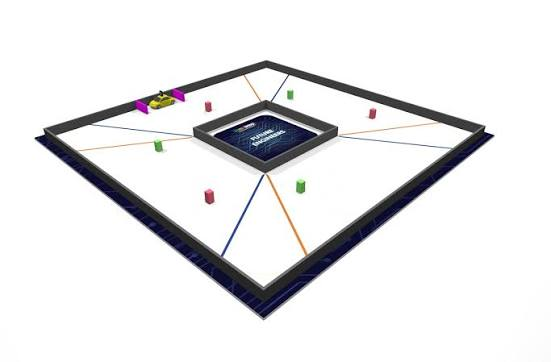

WRO Future Engineers asks for a vehicle that can drive itself — no remote control, no shortcuts, just sensors, math, and code making decisions in real time. The car has to complete laps around a track that changes every round: walls move, corners narrow, and in the Obstacle Challenge, coloured pillars appear that the car has to read and respond to correctly. Get it wrong, and the round ends early.

It's a small, contained problem on paper. In practice, it touches almost every corner of engineering: mechanical design, power distribution, real-time firmware, computer vision, and the occasional very frustrating GPIO conflict at 2 AM.

---

## 3. Our Approach — Drivetrain and Steering

Two mechanical decisions shaped everything else about this robot: how it turns, and how power reaches the wheels.

### Differential Drive

A single rear motor drives both back wheels through an open bevel-gear differential. The reason is simple — in every turn, the outer wheel has to travel further than the inner one. Without a differential, one wheel is forced to scrub sideways against the floor to compensate, and that scrub is unpredictable: it changes with speed, floor grip, and tire wear. None of that is something you want to fight in software.

<table align="center">
<tr>
<td align="center" width="400">
 
<b>The differential in motion</b>
</td>
<td align="center" width="400">
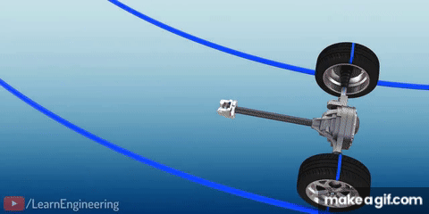 
<b>Inner vs. outer wheel arc distance</b>
</td>
</tr>
</table>

The differential solves this purely mechanically — no sensors, no control loop, just gears responding to resistance. Full reasoning and the comparison against a solid axle is in [`00_Research/04_mechanical/01_Differential.md`](00_Research/04_mechanical/01_Differential.md).

### Ackermann Steering

The front wheels don't turn together at the same angle — they can't, for the same reason the rear wheels can't spin at the same speed in a turn. Ackermann geometry angles the steering linkage so the inner wheel always turns more sharply than the outer one, keeping every wheel pointed at a common turn center.

<table align="center">
<tr>
<td align="center" width="400">
 
<b>Ackermann geometry in action</b>
</td>
<td align="center" width="400">
 
<b>The trapezoid linkage</b>
</td>
</tr>
</table>

This matters more than it might sound like. Zero scrub means the IMU-based heading controller only has to correct for genuine drift — not fight a lateral displacement that changes every lap. Full geometry, math, and the comparison against parallel steering is documented in [`00_Research/04_mechanical/02_ackermann-steering.md`](00_Research/04_mechanical/02_ackermann-steering.md).

---

## 4. Hardware Overview

### 4.1 The Two Brains: ESP32 + Raspberry Pi 5

The robot runs on two separate computers, each doing a different job.

<table align="center">
<tr>
<td align="center" width="260">
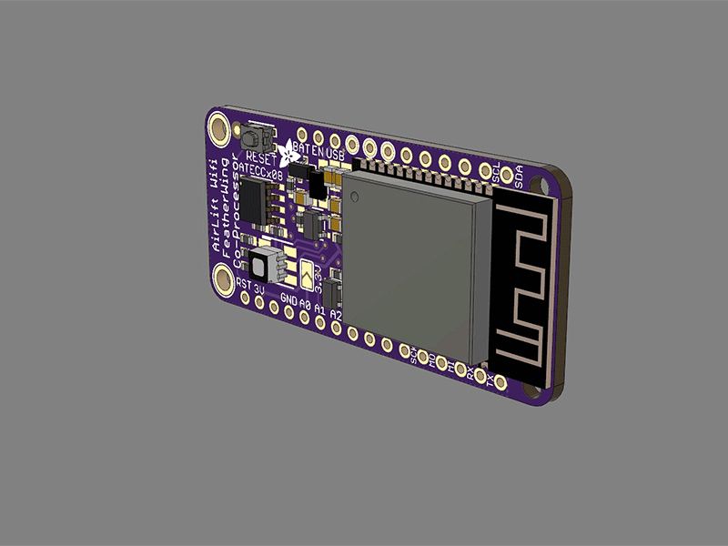 
<b>ESP32 — real-time control</b>
</td>
<td align="center" width="260">
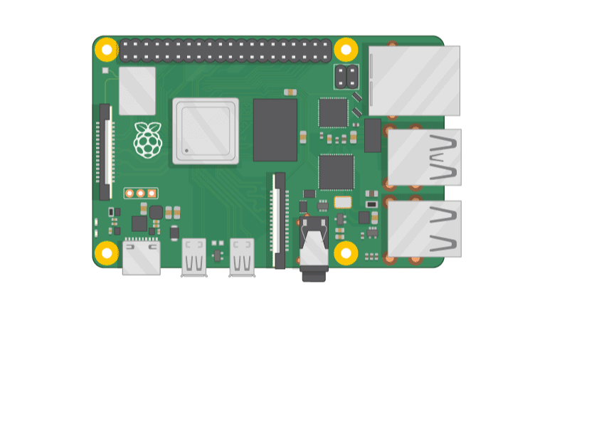 
<b>Raspberry Pi 5 — vision</b>
</td>
</tr>
</table>

The **ESP32** handles everything that has to happen in real time and can't afford to be late: reading the ToF sensors, reading the IMU, driving the motor, driving the steering servo, and running the state machine that decides what the car does next. It runs FreeRTOS, with each task — sensing, control, algorithm — kept strictly separated so a slow camera frame on the other board can never introduce jitter into a steering correction.

The **Raspberry Pi 5** is reserved for vision. Camera processing is comparatively heavy and doesn't need to run at the same tight, predictable cadence as motor control — so it lives on its own board entirely, talking to the ESP32 over UART.

  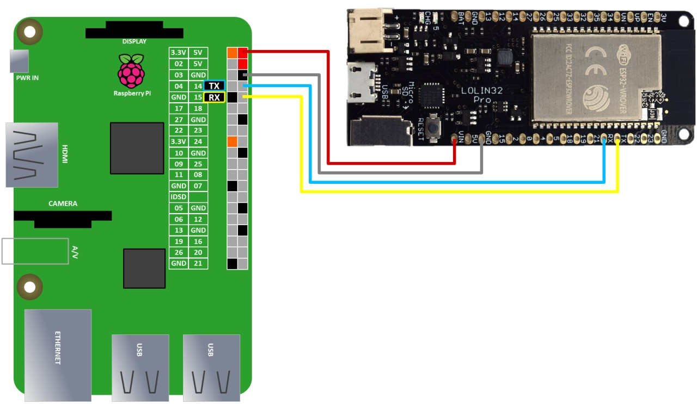

<b>How the two boards talk to each other</b>

Splitting the compute this way means a heavy vision frame never stalls a steering correction, and a firmware crash on the ESP32 doesn't take the camera pipeline down with it.

### 4.2 Vision: Raspberry Pi Camera Module 3

<table align="center">
<tr>
<td align="center" width="220">
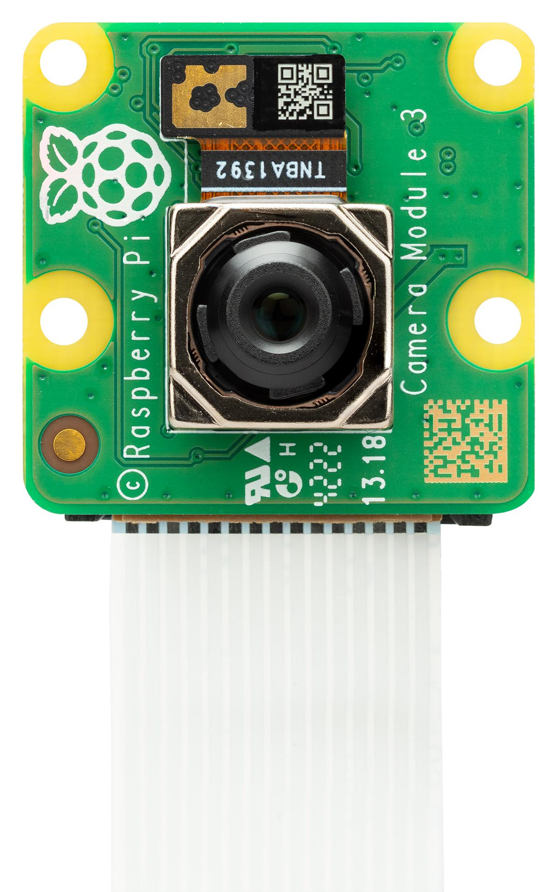 
<b>Camera Module 3, wide-angle</b>
</td>
</tr>
</table>

We're using the **Raspberry Pi Camera Module 3**, wide-angle variant (~120° diagonal FoV), connected over the Pi 5's CSI port. The wide field of view matters here — the car needs to see pillars and track edges well before it's close enough for a narrow lens to catch them, giving the vision pipeline more time to make a decision.

<table align="center">
<tr>
<td align="center" width="400">
 
<b>Connecting the camera</b>
</td>
</tr>
</table>

### 4.3 Bill of Materials

Every component on this robot was chosen against a calculated requirement first, not picked off a shelf. The motor's stall torque, the servo's stall torque, even the capacitor and resistor values, all trace back to a number derived in [`00_Research`](00_Research) before a single part was ordered. Below is a walk through the build, grouped the way we actually think about it: what thinks, what senses, what moves, and what keeps everything alive.

---

**Compute — the two things that think**

<table align="center">
<tr>
<td align="center" width="240">
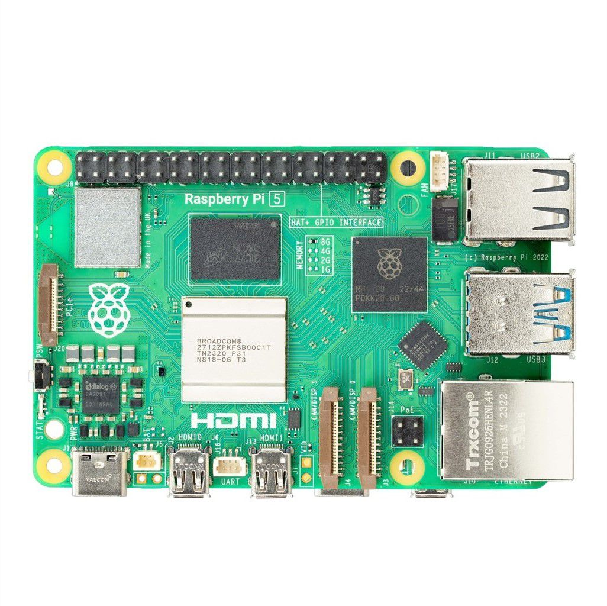 
<b>Raspberry Pi 5</b>
</td>
<td align="center" width="240">
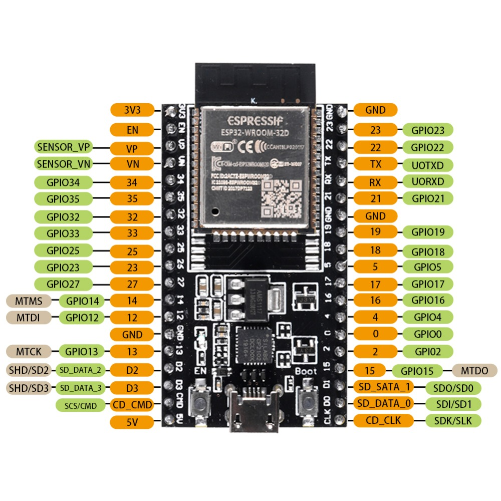 
<b>ESP32-DEVKITC-32D</b>
</td>
</tr>
</table>

The **Raspberry Pi 5** handles vision — capturing and processing camera frames, deciding where pillars are. The **ESP32-DEVKITC-32D** handles everything that needs to happen on a strict, predictable schedule: reading sensors, driving the motor, driving the servo, and running the state machine. Splitting these two jobs across two boards means a heavy vision frame can never introduce jitter into a steering correction.

---

**Sensors — the three things that feel the track**

<table align="center">
<tr>
<td align="center" width="240">
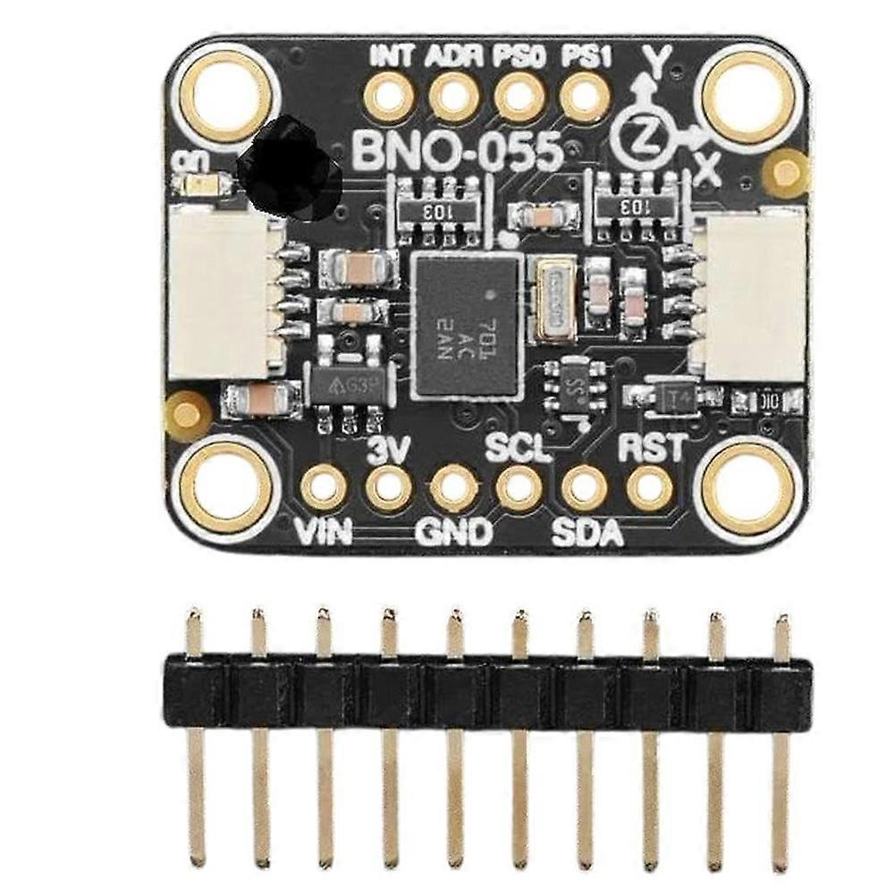 
<b>BNO055 IMU</b>
</td>
<td align="center" width="240">
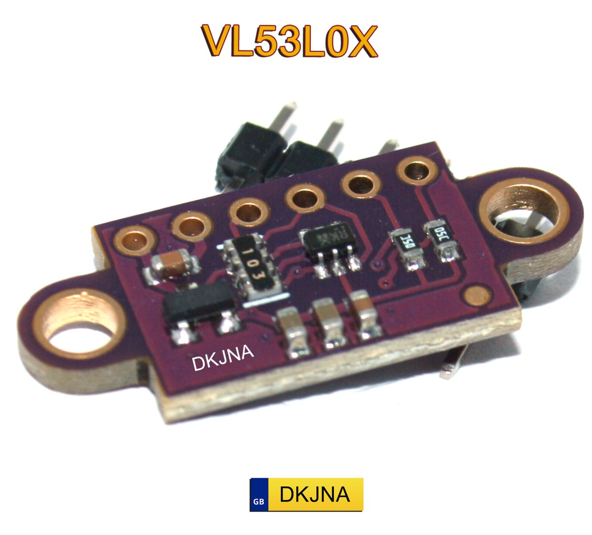 
<b>VL53L0X ToF ×3</b>
</td>
</tr>
</table>

The **BNO055 IMU** gives the robot an absolute sense of heading — it's what lets the car hold a straight line and execute a clean 90° turn without drifting. Three **VL53L0X ToF sensors** (front, left, right) act as the robot's proximity sense — detecting walls, corners, and when it's time to turn. A **hall-effect encoder** on the drive shaft rounds this out, giving distance and speed feedback for odometry.

---

**Actuators — the two things that move the car**

<table align="center">
<tr>
<td align="center" width="240">
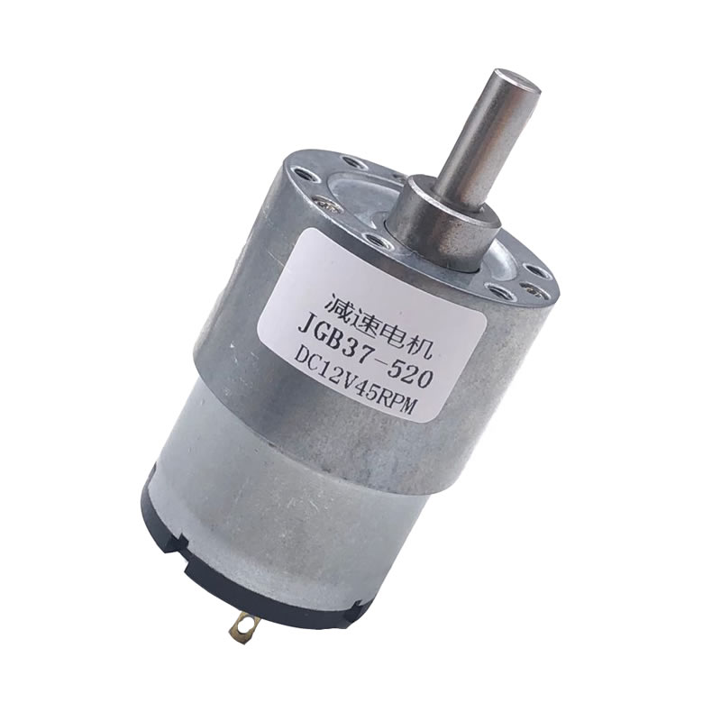 
<b>JGB37-520 DC motor</b>
</td>
<td align="center" width="240">
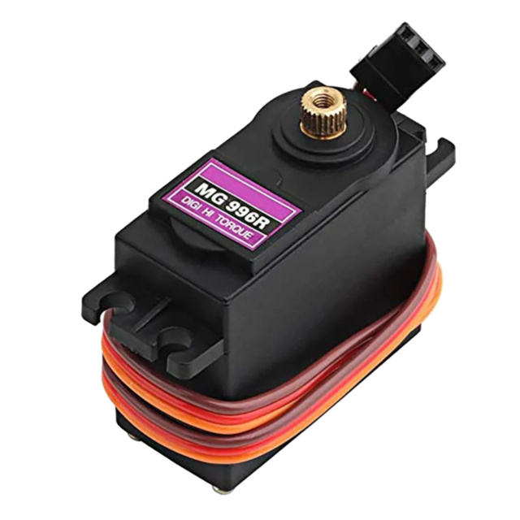 
<b>MG996R servo</b>
</td>
</tr>
</table>

The **JGB37-520 DC gear motor** drives the rear axle through the differential — sized so its stall torque clears ≥ 0.6 kg·cm, with full derivation in [`01_motor-selection-criteria.md`](00_Research/03_components_selection/01_motor-selection-criteria.md). The **MG996R servo** handles Ackermann steering up front, sized to clear ≥ 9.3 kg·cm of stall torque against tire scrub — worked out in [`02_servo-torque-requirement.md`](00_Research/03_components_selection/02_servo-torque-requirement.md).

---

**Power — what keeps it all alive**

<table align="center">
<tr>
<td align="center" width="240">
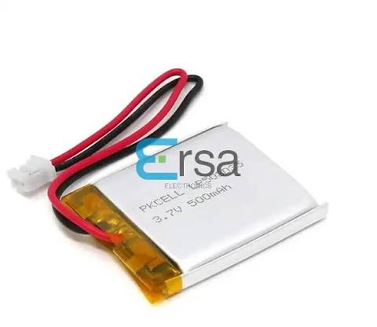 
<b>3S Li-Ion battery</b>
</td>
<td align="center" width="240">
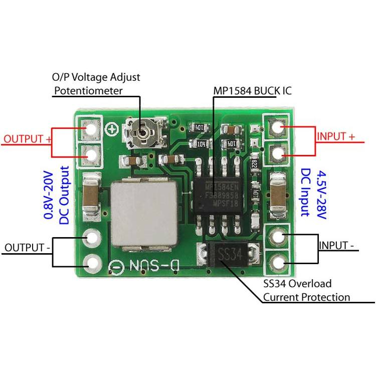 
<b>MP1584EN buck converter</b>
</td>
<td align="center" width="240">
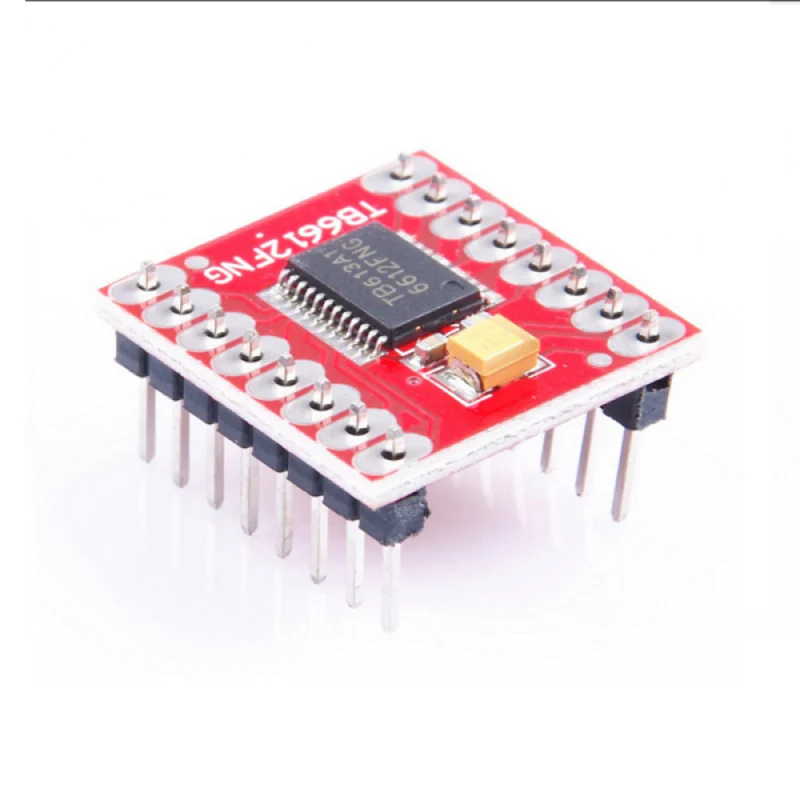 
<b>TB6612FNG driver</b>
</td>
</tr>
</table>

A single **3S Li-Ion battery** feeds everything. Two **MP1584EN buck converters** split that into an isolated 5V logic rail and a 6V servo rail — kept separate on purpose, more on that below. The **TB6612FNG** is the H-bridge that lets the ESP32's low-current logic pins control the drive motor's much higher current draw.

The full parts list, quantities, and every link back to its underlying calculation lives in [`01_Hardware/01_bill-of-materials.md`](01_Hardware/01_bill-of-materials.md).

---

### 4.4 Power Architecture

  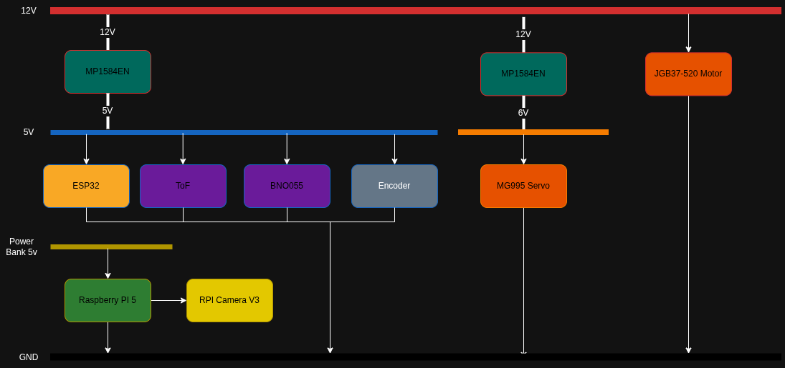

<b>The full power rail layout, battery to load</b>

The robot runs on a single 3S Li-Ion battery feeding two independent MP1584EN buck converters — one 5V rail for logic (ESP32, sensors), one 6V rail dedicated entirely to the steering servo. The drive motor draws directly from the battery through the TB6612FNG, bypassing both regulators entirely since the driver handles its own switching.

**Why isolate the servo?** Its stall current spikes to roughly 2.5A when it hits mechanical resistance — over eight times the entire logic rail's typical draw. If that spike shared a rail with the ESP32, it could sag the voltage enough to brown-out reset the microcontroller mid-turn. Isolating the rail means a stall event only affects the servo — the ESP32 keeps running, uninterrupted.

**Why capacitors matter here:** every regulator and every IC on these rails leans on a decoupling or bulk capacitor to survive sudden current demand. A capacitor, at its core, behaves like a small local reservoir of charge — it can dump current instantly in a way a battery several centimeters away, through resistive wire, simply cannot react to fast enough.

<table align="center">
<tr>
<td align="center" width="440">
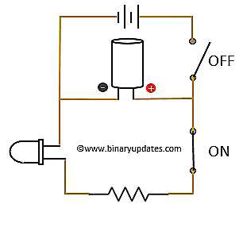 
<b>A capacitor acting as a local DC source</b>
</td>
</tr>
</table>

That's the whole idea behind decoupling: place a capacitor close enough to a hungry IC or a switching regulator that it becomes the fast-response source, while the battery handles the slow, steady-state supply. Full current budget, capacitor sizing per rail, and the math behind all of it is documented in [`01_Hardware/02_power-architecture.md`](01_Hardware/02_power-architecture.md), backed by the passive-component calculations in [`00_Research/03_components_selection/03_passive-components.md`](00_Research/03_components_selection/03_passive-components.md).

---

### 4.5 Wiring

  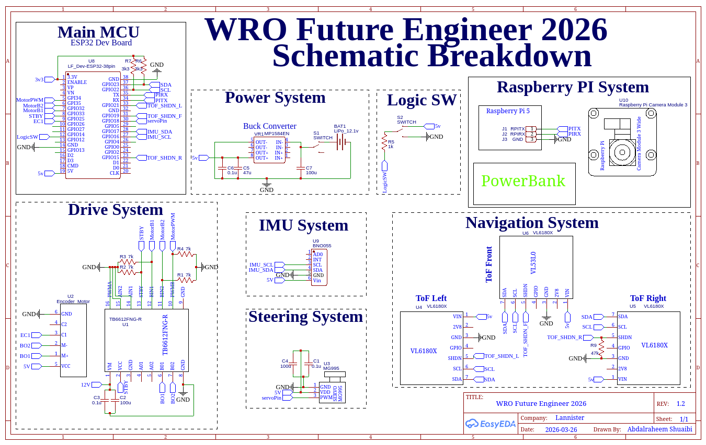

<b>The full circuit, as wired on the robot today</b>

This is the full schematic — every sensor, driver, and regulator wired exactly as it sits on the robot today. Two separate I2C buses keep the ToF sensors (which need XSHUT address remapping) electrically apart from the IMU, so a slow or stuck sensor on one bus can never stall the other. The motor driver, servo PWM, encoder, and the reserved Pi↔ESP32 UART lines round out the rest of the GPIO map.

Every pin assignment below is pulled directly from source code, not assumed — full pin-by-pin detail lives in [`01_Hardware/03_wiring.md`](01_Hardware/03_wiring.md).

---
## 5. Software

The robot's software is split the same way the hardware is: the **ESP32** makes every decision that has to happen on a strict clock — sensing, control, steering — and the **Raspberry Pi 5** handles everything that's too heavy to run at that pace, mainly camera vision. The two talk to each other over a single UART link, and neither one waits around for the other.

This section covers how that split is organized in code: the tasks running on the ESP32, where sensor data actually comes from, how the Open Challenge driving logic makes decisions, and the tool we built to watch all of it happen in real time.

---

### 5.1 Architecture Overview

Three layers, each with one job, and none of them reaching into the others:

- **Sensing layer** — dedicated tasks that only read hardware and publish the result. They never make decisions.
- **Control layer** — `control_task`, the highest-priority task on the board. It only executes PID controllers (heading hold, turn) and writes to the motor and servo. It never decides *where* to go, only *how* to get there.
- **Decision layer** — `algorithm_task`, the state machine. It reads what the sensing layer published, decides what should happen next, and tells the control layer through a small, explicit request API (`ctrl_request_turn()`, `ctrl_request_forward()`). It never touches a GPIO directly.

This separation is why a slow camera frame can never cause a jerky steering correction, and why a bug in the decision logic can't accidentally leave the motor driver in a bad state — each layer can only affect the next one through a narrow, well-defined interface.

<table align="center">
<tr>
<td align="center" width="820">
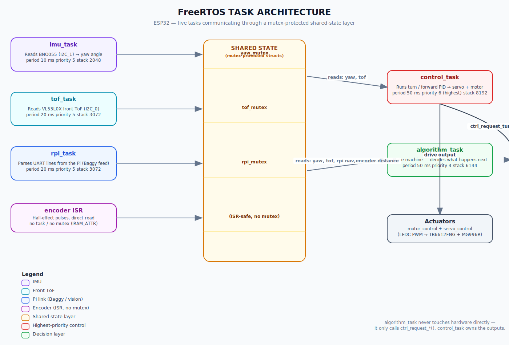 
<b>Five tasks, one shared-state layer, one direction of data flow</b>
</td>
</tr>
</table>

---

### 5.2 FreeRTOS Task Architecture

Every sensor lives in its own task, running at whatever rate that sensor actually needs — the IMU is read every 10 ms because heading drift compounds fast, while the Pi link is read every 20 ms because that's already faster than the camera can usefully update. Each task publishes its result into a small mutex-protected struct, and nothing about the other tasks needs to know or care how that struct got filled in.

| Task | Period | Priority | Job |
|---|---|---|---|
| `control_task` | 50 ms | 6 (highest) | Runs the active PID controller, drives the servo and motor |
| `imu_task` | 10 ms | 5 | Reads the BNO055, publishes yaw |
| `tof_task` | 20 ms | 5 | Reads the front VL53L0X, publishes distance + wall flags |
| `rpi_task` | 20 ms | 5 | Parses UART lines from the Pi, publishes nav + obstacle data |
| `algorithm_task` | 50 ms | 4 | Reads everything above, runs the state machine |

Two details worth calling out:

- **`control_task` outranks `algorithm_task` on purpose.** If the board is ever under load, the thing that has to stay smooth is the PID loop, not the decision logic — a state machine that runs a few milliseconds late is invisible to the robot, a jittery servo isn't.
- **The encoder doesn't get a task at all.** It's a single hall-effect sensor driven entirely by an ISR (`IRAM_ATTR`, `volatile` tick counter), so there's no polling loop and no mutex needed — `encoder_get_distance_mm()` just reads the counter directly. One less task means one less thing that can stall.

---

### 5.3 Sensor Data Flow

It's one thing to know a sensor exists — it's another to trace exactly what happens to that reading between the moment it leaves the hardware and the moment it changes what the car does. This diagram follows all four sensing pipelines end to end: physical sensor → how it's processed → what gets published → what decision it actually feeds.

<table align="center">
<tr>
<td align="center" width="670">
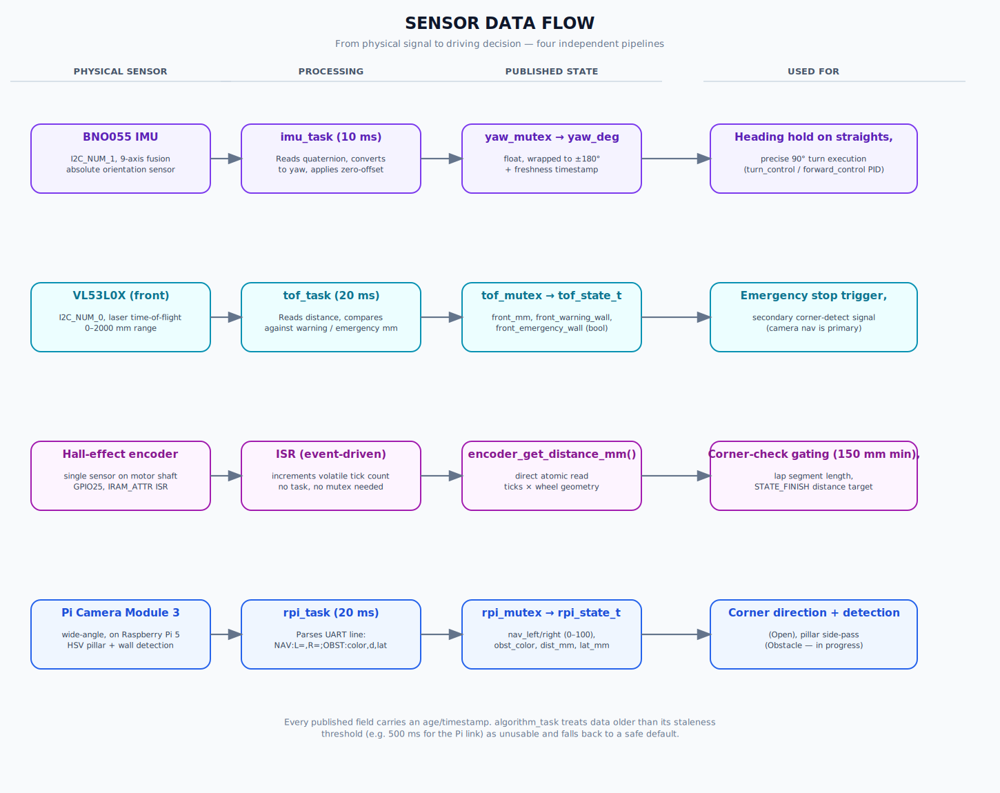 
<b>From raw signal to driving decision, four independent pipelines</b>
</td>
</tr>
</table>

The one rule that holds across all four: **every published value carries an age.** `algorithm_task` never trusts a stale reading — if the Pi link goes quiet for more than 500 ms, for example, the algorithm falls back to holding position rather than steering based on data that might not reflect the real world anymore. That single check is what keeps a dropped camera frame or a momentary UART hiccup from turning into a wrong turn.

---

### 5.4 Algorithm — Open Challenge

The Open Challenge track has no traffic signs and no pillars — the whole job is staying inside a corridor that changes width every section and finding the corners before the walls do. Here's how the state machine handles that, start to finish.

<table align="center">
<tr>
<td align="center" width="570">
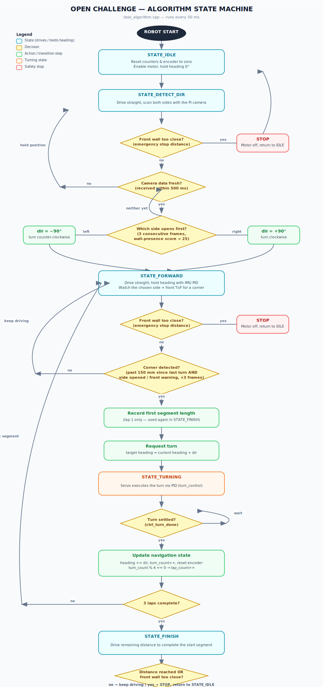 
<b>The full Open Challenge state machine, as implemented in <code>task_algorithm.cpp</code></b>
</td>
</tr>
</table>

**The short version:**

1. **`STATE_IDLE`** — the robot resets everything (encoder, turn count, lap count) and starts driving forward, holding heading 0°.
2. **`STATE_DETECT_DIR`** — since the starting position and track direction are randomized by die roll, the robot doesn't know yet whether it's turning clockwise or counter-clockwise. It drives straight and watches both sides through the Pi camera until one side's wall-presence score drops below the open threshold for three consecutive frames — that's the direction it commits to for the rest of the run.
3. **`STATE_FORWARD`** — the main driving state. The robot holds heading with the IMU-based PID and watches the side it committed to (plus the front ToF as a backup) for the next corner.
4. **`STATE_TURNING`** — once a corner is confirmed, the robot hands off to `turn_control`, which executes a clean 90° turn using IMU feedback, independent of the forward heading-hold controller.
5. Back to **`STATE_FORWARD`** for the next straight, repeating until three laps and twelve turns are complete.
6. **`STATE_FINISH`** — the final stretch back to the starting section, sized using the length of the very first straight the robot drove (recorded once, on lap one).

A front-wall emergency check runs in every state that's actively driving — if the ToF ever reports a wall closer than the emergency threshold, the robot stops immediately and falls back to `STATE_IDLE`, regardless of what else is happening.

**Why side ToF sensors aren't in this diagram:** corner detection used to rely on the left/right VL53L0X sensors directly. That's been replaced by the Pi camera's wall-presence score (`nav_left` / `nav_right`), which gives a wider, more forward-looking view of the corridor than a single-point distance reading ever could. The front ToF is kept purely as a safety net for emergency stops.

*[Camera captures showing the wall-presence detection in action will go here once we have clean footage from the track.]*

---

### 5.5 Algorithm — Obstacle Challenge

*Not implemented yet — `task_algorithm.cpp` currently only contains the Open Challenge state machine shown above.*

The plan: the Pi already reports pillar color, distance, and lateral offset (`obst_color`, `obst_distance_mm`, `obst_lateral_mm`) over the same UART link used for wall-following. The ESP32 side will use that to bias the heading-hold target left or right by the correct margin — pass red on the right, green on the left — timed against the encoder rather than reacting frame-by-frame, so a single noisy detection can't cause a swerve.

This section, along with its own flowchart (`algorithm_flowchart_obstacle_challenge.svg`), will be filled in once that logic is written and tested.

---

### 5.6 PID Control & Tuning

Both the turn and the heading-hold controllers described above run on the same underlying idea: PID control. This section explains what that means, what our actual gains are, and the process we followed to get there.

<table align="center">
<tr>
<td align="center" width="720">
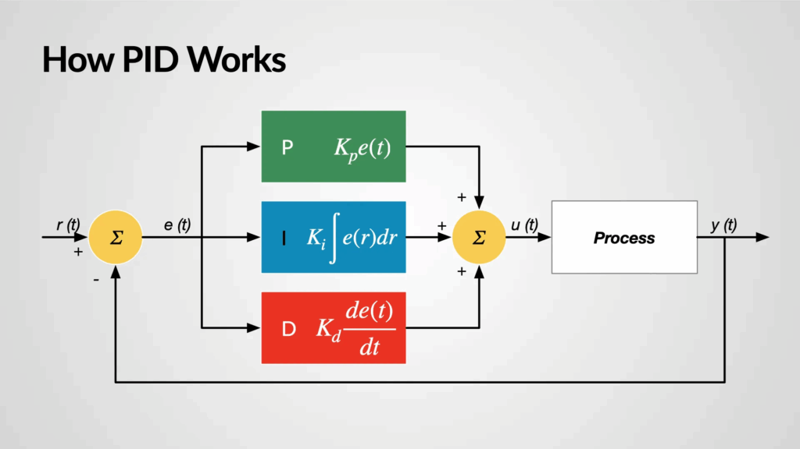 
<b>The closed loop: target heading in, yaw out, error drives the correction</b>
</td>
</tr>
</table>

**What PID actually does**

A PID controller looks at the gap between where you want to be (the target) and where you actually are (the measurement), and turns that gap into a correction — in our case, a servo angle. It does this with three terms added together:

- **P (Proportional)** — reacts to the error *right now*. A bigger gap means a bigger correction. On its own, P gets you close to the target fast, but it tends to overshoot and settle into a gentle oscillation around it, since it has no sense of how fast the error is changing or how long it's been wrong.
- **I (Integral)** — reacts to the error *accumulated over time*. If a small error keeps hanging around instead of disappearing, the integral term keeps growing until it forces the correction large enough to close that gap for good. This is what cancels out steady, persistent offsets — the kind caused by things like mechanical friction, a servo that isn't perfectly centered, or a slight weight imbalance.
- **D (Derivative)** — reacts to *how fast the error is changing*. It acts like a brake: as the system approaches the target quickly, D pulls the correction back down before it can overshoot, which is what settles the oscillation P leaves behind.

Put together, P gets you there, D stops you from flying past it, and I makes sure you don't quietly drift off and stay off.

---

**Our two controllers**

We run two separate PID loops, both steering-output, both sharing the same `pid_update()` function — but tuned very differently, because they're solving different problems:

| | `turn_control` | `forward_control` |
|---|---|---|
| **Job** | Execute a fast, accurate 90° turn | Hold a straight heading, correcting small drift |
| **Kp** | 0.8 | 2.5 |
| **Ki** | 0.075 | 0.15 |
| **Kd** | 0.055 | 0.02 |
| **Output clamp** | ±30° (`max_steer_angle`) | ±45° (`max_correction`) |
| **Settle condition** | within ±20° for 6 consecutive cycles | continuous, no settle check |

The difference in gains isn't arbitrary — it comes directly from what each controller is actually correcting:

- `turn_control` is chasing a large step change (up to 90°), so a lower Kp is enough to move it — pushing Kp higher on a target that big risks a much harder overshoot. Its settle logic (`stable_count` / `stable_need`) exists because a turn has a real finish line: the robot needs to *know* when it's done, not just keep nudging forever.
- `forward_control` is only ever correcting small drift around a heading it's already close to, so it needs a sharper Kp to react to tiny errors quickly — but a smaller Kd, since there's no large overshoot to brake for, and a tighter output clamp, since a heading-hold correction should never look like a turn.

---

**How we tuned them**

We didn't calculate these gains from a model — we tuned them by hand, on the assembled robot, in a fixed order:

<table align="center">
<tr>
<td align="center" width="1370">
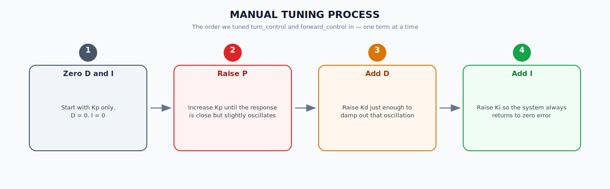 
<b>The order we followed for both controllers</b>
</td>
</tr>
</table>

1. **Zero D and I.** Start with a pure proportional controller so every effect we see is coming from one term.
2. **Raise P** until the response gets close to the target quickly but starts to show a small oscillation. That oscillation is the signal to stop — it means P is doing its job and it's time to bring in the next term.
3. **Raise D** just enough to damp that oscillation out. Too little and it still wobbles; too much and the response gets sluggish and lags behind the correction it needs to make.
4. **Raise I** last, only enough to guarantee the system always closes the remaining gap and returns to zero error, without introducing a slow new oscillation of its own (integral windup).

The chart below shows what that process actually looks like, simulated with our real `turn_control` gains at each stage against a simplified plant with a constant disturbance (standing in for real friction and servo bias):

<table align="center">
<tr>
<td align="center" width="1320">
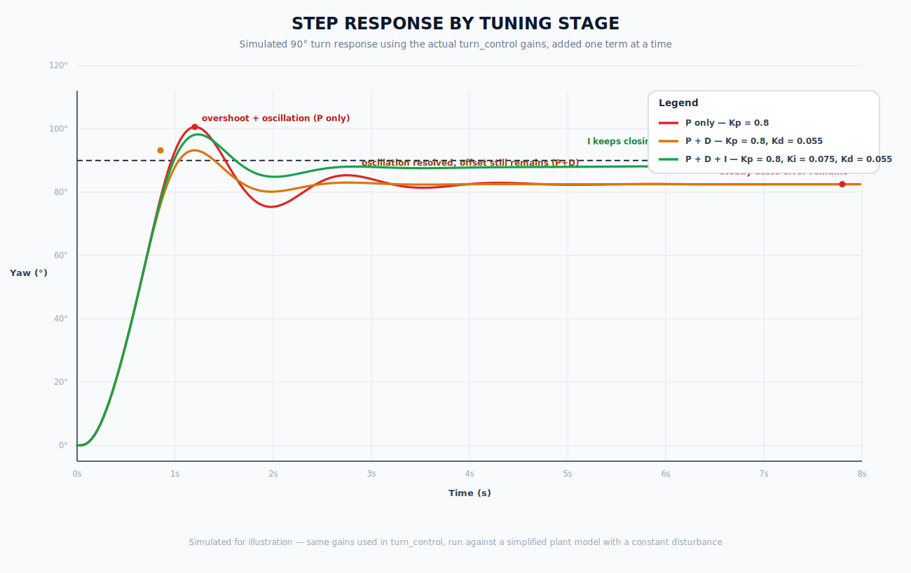 
<b>Step response at each tuning stage — same gains, added one term at a time</b>
</td>
</tr>
</table>

With P alone, the response overshoots the 90° target and oscillates before settling on an offset well short of it. Adding D kills the oscillation almost immediately — but that steady offset doesn't move, because D only reacts to *change*, and once the system stops moving, D has nothing left to correct. Only once I is added does the controller keep pushing until that last bit of error is gone.

**Same process, `forward_control`**

`forward_control` goes through the exact same four steps, but the job it's tuned for is different — instead of executing one large 90° turn, it's constantly nudging the heading back after a few degrees of drift. The chart below simulates that: an 8° correction, using the real `forward_control` gains at each stage.

<table align="center">
<tr>
<td align="center" width="1320">
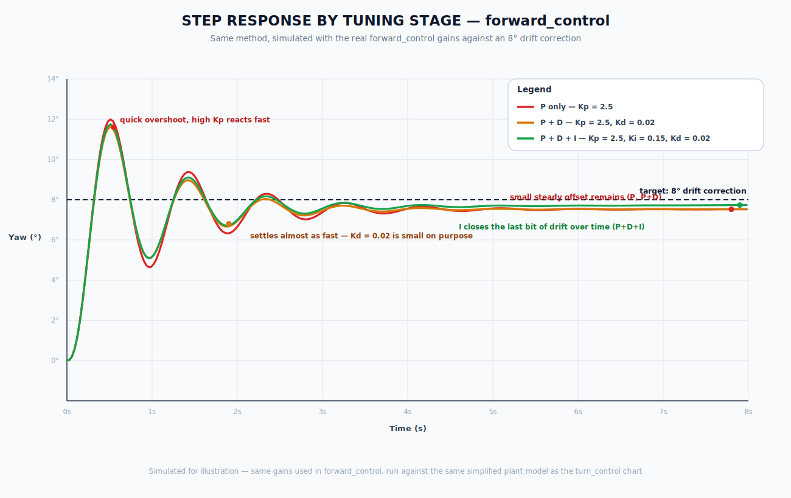 
<b>Step response at each tuning stage — forward_control, corrected for a small drift instead of a full turn</b>
</td>
</tr>
</table>

The shape is the same story, just compressed: a much higher Kp (2.5 vs 0.8) means P alone reacts and overshoots fast, within about half a second instead of over a second. What's different is how little D has to do — Kd is only 0.02, a fraction of `turn_control`'s 0.055, because there's far less momentum to brake for when the error is a few degrees instead of ninety. Ki is higher (0.15 vs 0.075) since drift correction has to keep catching up continuously, not just once at the end of a maneuver. The result is a controller tuned to be quick and light-handed, exactly what holding a straight line while driving needs — a controller tuned for a big turn would feel twitchy here, and a controller tuned for gentle drift would feel sluggish trying to execute a 90° turn.

---

### 5.7 Telemetry & Debug Tool — Baggy

<table align="center">
<tr>
<td align="center" width="720">
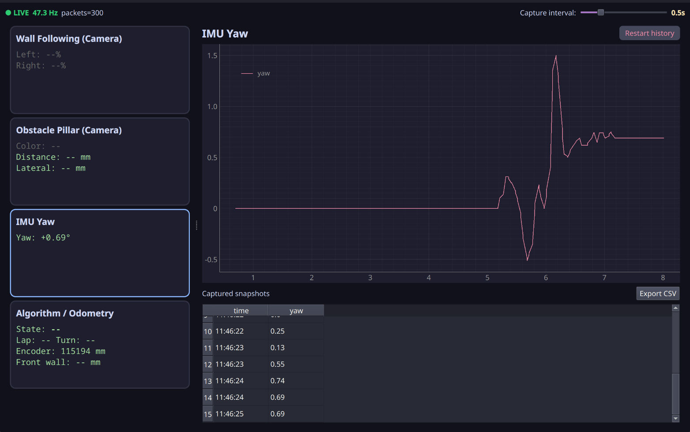 
<b>Baggy — our real-time telemetry dashboard</b>
</td>
</tr>
</table>

*[Screenshot and full write-up pending — Baggy is still under active development.]*

Debugging a robot that's driving itself, at speed, on a track you can't see from your laptop, is genuinely hard without visibility into what it's thinking. **Baggy** is our answer to that: the ESP32 streams live sensor and state data over Wi-Fi UDP — yaw, ToF readings, encoder distance, the current state machine state, lap and turn counts — and Baggy renders it in real time so we can watch a run unfold from the sideline instead of guessing after the fact from serial logs.

*[More detail on Baggy's design and how it's used during test runs will go here once the tool is further along.]*

---

## 6. Repository Map

| Folder | Contents |
|---|---|
| [`00_Research`](00_Research) | The reasoning behind every decision — component selection criteria, mechanical calculations, comparisons |
| [`01_Hardware`](01_Hardware) | Final bill of materials, power architecture, and wiring — what was actually built |
| [`02_Software`](02_Software) | Firmware and vision source code |
| [`03_Models`](03_Models) | CAD and 3D print files |
| [`04_PCB`](04_PCB) | Schematics and PCB design files |
| [`05_Media`](05_Media) | Robot and team photos, video links |
| [`06_Attachments`](06_Attachments) | Logo, diagrams, and supporting animations used across this documentation |

---

## 7. Behind the Build

A few photos from the process — the practice mat, the pillars, and the robot itself mid-build.

---

**The practice mat**

Our university has an official WRO mat we could test on — in theory. In practice, getting there every day wasn't something we could count on. Road closures and checkpoints across the West Bank can turn a normal commute into hours of uncertainty, or make it impossible altogether, so building a testing schedule around "just drive to uni" wasn't realistic.

<table align="center">
<tr>
<td align="center" width="500">
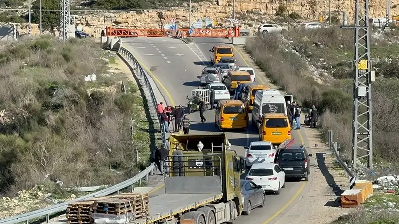 
<b>What a normal commute can look like here</b>
</td>
</tr>
</table>

So we built our own. Cheap boards, spray paint, and a lot of newspaper to protect the floor — the same mat, made at home, out of whatever we could actually get our hands on.

<table align="center">
<tr>
<td align="center" width="330">
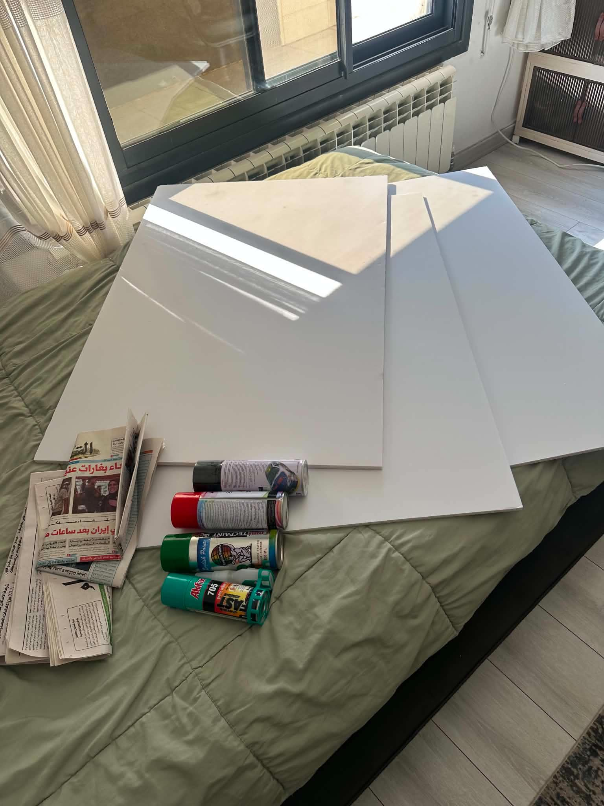 
<b>Boards and spray paint — the start of it</b>
</td>
<td align="center" width="330">
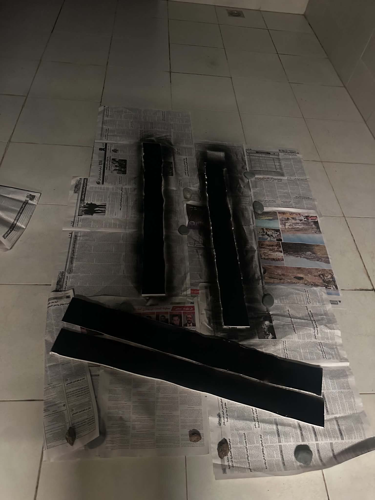 
<b>Border strips, freshly painted</b>
</td>
<td align="center" width="330">
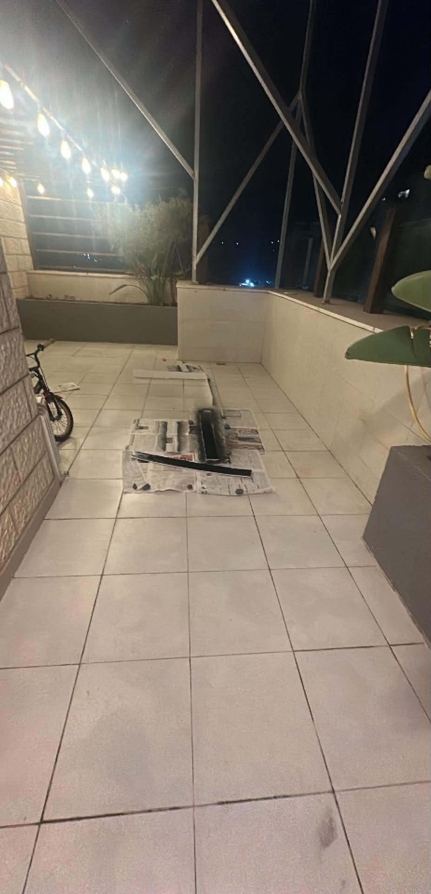 
<b>Still drying, late on the terrace</b>
</td>
</tr>
</table>

<table align="center">
<tr>
<td align="center" width="330">
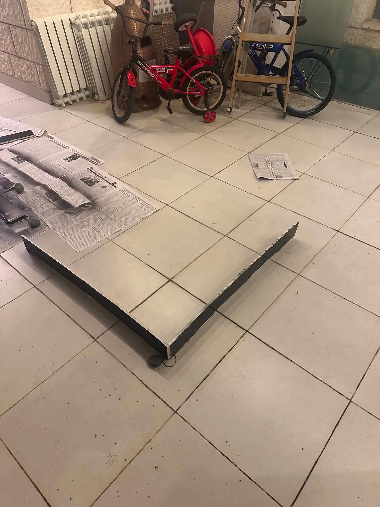 
<b>Rolling frame, ready to move</b>
</td>
<td align="center" width="330">
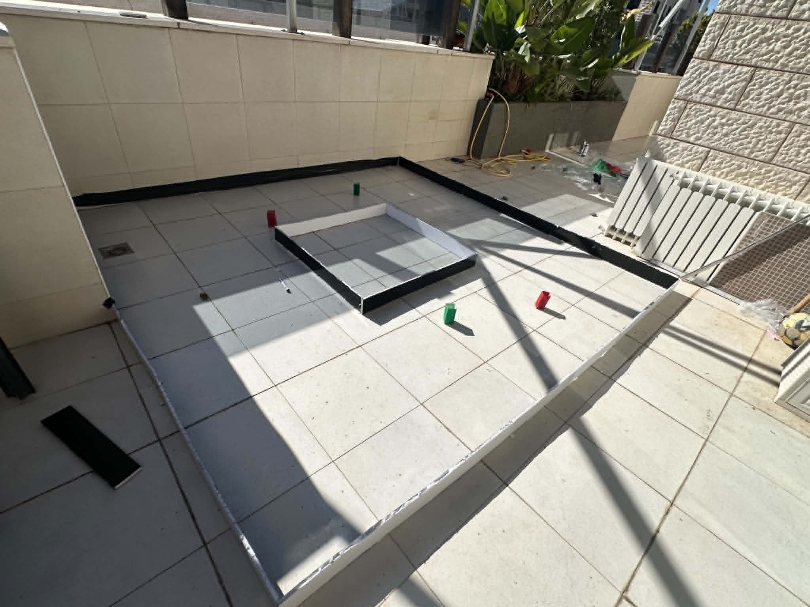 
<b>Track border laid out on the terrace</b>
</td>
<td align="center" width="330">
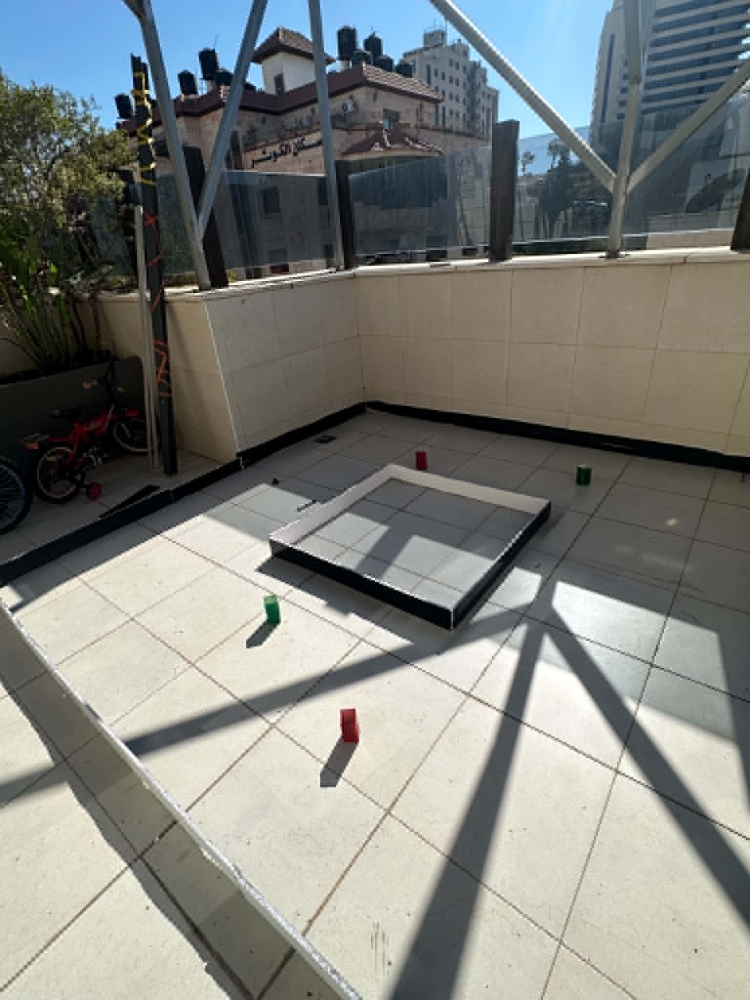 
<b>Test pillars placed for size</b>
</td>
</tr>
</table>

---

**The workbench**

This is where the actual engineering happens — not in the documentation, here. Every part on this desk went through the same loop: measure it, print or cut it, test-fit it, and almost always redo it. Half-finished pillars next to calipers, wheels waiting to be wired, a soldering iron that never really gets put away. It's not clean, but every single fix in this repo started as a mess on this exact desk.

<table align="center">
<tr>
<td align="center" width="500">
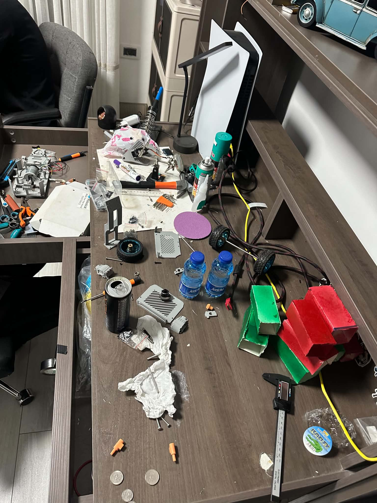 
<b>Mid-build — pillars, wheels, tools, and a couple of water bottles</b>
</td>
</tr>
</table>

---

**The robot**

The first real test on our own mat is what changed things. A calculation on paper is one thing — watching the robot actually try to turn, actually try to see a pillar, on the exact surface and dimensions we'd built, is another. Some assumptions from the spec sheets didn't survive contact with the real mat, and the chassis went through a redesign because of it. What's shown across this README is the result of that — not the first version we built, but the one that came out the other side of testing on the thing in the photos above.

<table align="center">
<tr>
<td align="center" width="500">
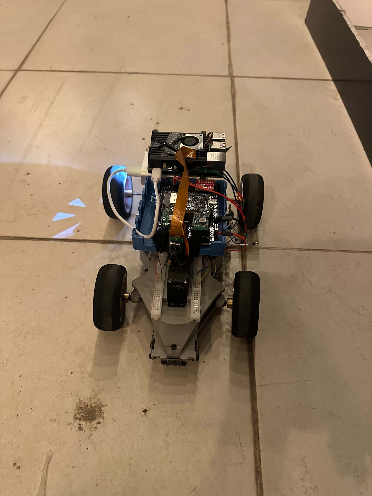 
<b>Pi 5 and ESP32 stacked up top, wired in</b>
</td>
</tr>
</table>

---

## 8. Build & Run

*Build, compile, and upload instructions will be added here once the firmware and vision pipeline reach a stable release.*

---

<em>More to come as the build progresses.</em>

